# Core conepts


## Architecture
- Worker nodes
	- Has pods
	- Runs work
- Master node
	- Stores node information
	- Places pods on workers based on policies (kube-scheduler)
	- has the Control plane
	- Keeps track of container info in a database (etcd cluster)
	- Node controller takes care of handling nodes
	- Replication controller (checks desired pod status)
	- kube-apiserver controls all API actions to the cluster and between controllers
- Applications are in form of containers
- Container Runtime Engine runs the containers (Docker, Containerd, Rocket)
- Every worker node has the kubelet, an agent that listens for kubeapi instructions to run instructions and manages the node containers
- kube-proxy handles network communication between the containers in worker nodes, one in every worker node

## etcd
- Distributed key-value store database
- Stores a key with a value. You send the key, returns one value
- Keys are unique
- Simple and Fast
- Used for configuration states
- Runs in the kube-system **(inside the master node)** namespace
- If run in HA, runs in every master node, you tell it the IP's of all the etcd nodes
### etcd setup
- **Manual Setup** :
	- If you setup your cluster from scratch then you deploy ETCD by downloading ETCD Binaries yourself
	- Installing Binaries and Configuring ETCD as a service in your master node yourself.
- **Setup Kubeadm** : 
 	- If you setup your cluster using kubeadm then kubeadm will deploy etcd server for you as a pod in kube-system namespace.
 
	
## kube-api
- kube-apiserver is the primary management controller in kubernetes
- kubectl runs api requests against kube-apiserver
- kube-apiserver authenticates, validates the requests, then retrieves the data.
- When a pod is created, kube-apiserver updates etcd with the info provided by kube-scheduler, then kubelet deploys e container and updates back with that information
- if you used kubeadm, it was deployed as a pod with files on /etc/kubernetes/manifests, otherwise it was installed on the system

## kube-controller-manager
- Controllers monitor (through the kube-api server) components and brings them to the desired state
- **node-controller** Every 5 seconds it checks heartbeat of a node, after 40 seconds it marks it unreachable, after 5 minutes it removes the pods and provisions them on a healthy node
- **replication-controller** monitors the desired number of pods are up and provisions as necessary
- many kube-controllers, all managed by **kube-controller-manager**
- if installed with kubeadm, kube-controller-manager is a pod. Options in /etc/kubernetes/manifests. If not, it is on the process list.

## kube-scheduler
- decides where to create pods, but doesn't create them, the kubelet creates pods
- Needed to use the resources as efficiently as possible
- 2 phases: 
	- 1 filter nodes that cannot fit the pod, too small 
	- 2 ranks the remaining nodes in a scale 0-10 with stats like free resources, then chooses the better rank
- if installed with kubeadm, it is a pod. If not, it is on the process list

## Kubelet
- In every worker node
- When it gets a request, it creates the pod with the container runtime and monitors its status
- If installed with kubeadm, it doesn't deploy it as a pod. It needs to be manually installed.

## kube-proxy
- Manages networking
- Every pod can reach every other pod
- Virtual network spanning all nodes
- IP's are ephimeral, pods are accessed through services
- Services are not actual containers or processes, they are virtual components that live in kubernetes's memory
- **kube-proxy is a process that runs on every kubernetes node**, Its job is to look for new services and every time a new service is created it creates the appropriate rules on each node to forward traffic to those services to the backend pods.
- using iptables rules in all nodes to forward traffic
- deployed as pods on every node as a daemonset

## Pods
- Applications are deployed to worker nodes as containers inside of a **Kubernetes object** named **Pods**
- A pod is the smallest object in Kubernetes
- **Every pod is a single instance of an application**
- If load needs to be shared, we create a new pod
- To **scale up** you **add pods**, to **scale down** you **delete pods**. Y**ou do not add containers to your pod**.
- Pods can be multi-container. Not of the same type usually, but can have helper containers like data processors.
- Pods can communicate with each other as they share the same network space and storage space
- When a pod is created or destroyed it affects all of the containers inside the pod.
- you can run a pod with `kubectl run [name] --image [image]`, like `kubectl run nginx --image nginx`
- you can see pods with `kubectl get pods`
- Without a service, pods are inaccessible from outside the node.

## pods with yaml
- Pods can also be created with a yaml file.
- Always has 4 main *reqired* top elements: `apiVersion`, `kind`, `metadata` and `spec`.
- `apiVersion` specifies the version of the API we use to parse this yaml file
- `kind` specifies what this declaration is, like `pod`, `service`, `replicaSet`...
- `metadata` has data about the object, like the `name` string and `labels` dictionary.
- Indentantion is important
- `spec` is a dictionary with the array `containers` in it which specifies the containers in the pod, like the container name and image.

## Replication controllers
- We need pod replicas so if a pod fails we still have other instances to keep service
- You need a replication controller even **if you have 1 pod**
- The replication controller ensures you have the desired number of pods **(High Availability)**
- Replication Controller is being replaced by ReplicaSets
- As all kubernetes objects we have apiVersion, kind, metadata and spec
- Under spec we set a pod template (everything in a pod definition except apiVersion and Kind)
- The spec also has a replicas field to tell it how many pods to create from the template
- Once applied, it creates the pods required

## replicaSets
- Successor to replication controllers
- Same format as replication controller with different apiVersion and Kind, **except a selector field** they add.
- can manage pods that are not created as part as the repllicaset creation(created by other replicasets).
- it has a matchLabels list of values which matches labels on the pods it will manage
- The labels serve to add existing pods to the current group, **so it knows it doesn't have to create new ones**, or maybe it needs to destroy some.

## Deployments
- Deployments allow for tasks like rolling updates, traffic pausing, rollback of pods...
- a ReplicaSet is an element inside of a Deployment.
- Same format as a ReplicaSet, but with kind Deployment
- Deployments automatically create replicaSets, which create pods

## Namespaces
- A kubernetes construct that holds elements like deployments and pods
- All resources in Kubernetes are assigned to a namespace
- Kubernetes cluster control resources are based on the **kube-system** namespace, to isolate them from the user and to prevent you from accidentally deleting or
modifying them.
- user-facing resources(resources that should be available to all users) are on the **kube-public** namespace
- You can create namespaces for different resource groups, like dev or prod
- You can assign access rules and resources to each namespace
- Elements on the same namespace can reach each other by common name, like db-service
- Inter-namespace communication requires a fully qualified resource name. like db-service.dev.svc.cluster.local where dev is the namespace, svc specifies it's a service, and cluster.local tells it to search on the current cluster (this is the default value).
- You need to specify a namespace to list resources in it, like kubectl `get pods -n kube-system`
- When you create a resource you specify it in the metadata block
- You can create a namespace in yaml with an apiVersion, kind and Metadata block
- you can create r**esourceQuota resources** for a specific namespace like memory usage limitations, pod number and CPU usage
- The DNS FQDN for inter-namespace communication follows the format [resource name].[namespace].[resource type].[cluster TLD, generally cluster.local]

## Services
- Services enable communication between applications and with the outside world
- Pods are on a separate network from the cluster or external machines
- Without a service you can only access a pod from its node
- Services are objects used to allow external access to pods
- It has several different options: nodeport exposes a port on the node where the pod is. ClusterIP creates a virtual IP to allow communication cluster-wide, and LoadBalancer allows access from a load balancer IP from supported cloud providers
- NodePort involves 3 ports: TargetPort (the port the container listens on), Port (the internal port on the service) and nodePort (The port the node listens on, 30000 to 32767)
- All of this is specified on the spec of the service which has 2 parts, type and ports.
- Type specifies the kind of Service we are creating (NodePort/ClusterIP/LoadBalancer)

### Services: NodePort

- You can have multiple port mappings within a single service
- Part of the spec is selector, which links the service to the target pod based on tags
- In a production environment you need to load balance between **multiple pods**, which the Service does based on the pod tags. It distributes the **load randomly**, but preferring to **keep sessions on a single pod**
- The service is created in **all the nodes**, so when the pod moves, you can still access it

### Services: ClusterIP
- Pod IP's are temporary, you cannot rely on them for internal communication
- Kubernetes services help us unifying communication between pod groups like a database cluster or a database replicaSet
- With this service type any pod on any node can access any other pod on another node
- Default value for services
We refer to the target pods on the service with their selector tags

### Services: LoadBalancer
- Available on supported cloud providers: GCP, AWS, Azure
- If set on an unsupported platform, it has the same effect as NodePort

## Imperative vs Declarative creation
- You can create resources either with the CLI (imperative) or with yaml files (declarative)
- In the imperative system you declare how to do something, but in the declarative model you tell it what to do and let the system handle it
- Changes with imperative commands are ephimeral, but with declarative configuration we can use version control tools to keep track of configuration
- On declarative configuration kubectl either creates the object if it doesn't exist, or patches in the new configuration values. In both cases Kubernetes updates the internally stored configuration
- This internal configuration is kept to keep track of changes that are being applied to the resource.

# Scheduling

## What is the scheduler
- The scheduler decides the best node to put the pod in
- If no scheduler is present pods do not start, stay as pending
- There is automatic scheduling and manual scheduling

## Manual scheduling
- If there is no scheduler and no node is manually assigned (`nodeName value on the pod spec`), pods stay pending
- You cannot modify a pod to send them to a node
- You can send an existing pod to a node through a **binding object** or by manually setting scheduling info like `nodeName`

## Labels and selectors
- Tools used to group resources together to be able to filter and act on them together
- Labels help you group resources together, like grouping animals as mammals class
- Selectors are used to filter resources and retrieve them or act on them, like applying something to all mammal-class animals
- You can add multiple labels and filter by multiple selectors
- in Kubernetes we use this to filter objects by type, application or functionality
- Kubernetes has internal tags
- We can also declare our own arbitrary tags
- under metadata, on the labels object, we can create as many labels we want
- When checking resources witk kubectl we filter with the `--selector` tag, like `kubectl get pods --selector app=nginx-app`
- **Annotations are similar to labels**, but not used internally for pattern matching on Kubernetes, for information like application version

## Taints and tolerations
- Taints prevent tagged resources from landing on a tainted node
- Tolerant resources can land on a node that matches the tolerations
- Both have to be applied to get certain requirements: if you want a node to be for only one application, you apply a taint for any pod, and add a toleration for a specific pod declaration
- On the last example only that tolerated pod can land in that node, the rest of the pods will not go to that node based on the scheduler rules
- This restricts pods from landing on a tainted node, **but does not guarantee that a tolerated pod will land on the tainted node**

### Taints
- **Taints are set on nodes**, for example with `kubectl taint nodes node-01 app=nginx-app:{NoSchedule|PreferNoSchedule|NoExecute}`
- NoSchedule avoids new non-tolerant pods getting to the node, but lets the existing ones stay
- PreferNoSchedule will try not to schedule pods to the node, but has the chance to do it in case it needs to
- NoExecute will not schedule new non-tolerant pods on that node and will also evict(kill) the current ones that don't match the toleration rule
- **Master is tained:** A taint is set up on the master node so it doesn't run any worker pods, so it can focus its work on cluster management

### Tolerations
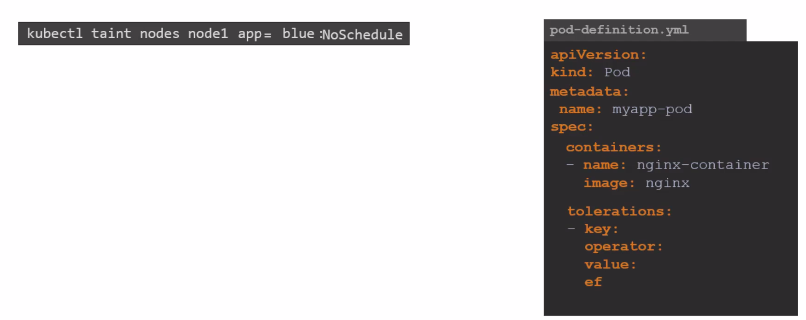
- **Tolerations are set on pods**
- Add a section to spec named `tolerations`
- This section has four key-value pairs: `key`, `operator`, `value` and `effect`
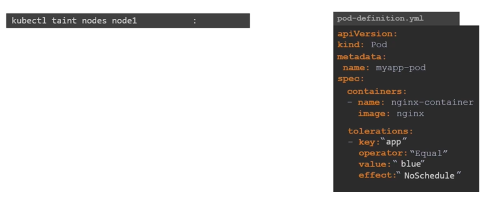
- **This four key-value pairs are the same values used when creationg the taint on the node**
- The values all need to be encased in double quotes
- These four values are in a list, so you can add several tolerations to a single pod definition

## NodeSelectors
- In an environment with different node sizes and workloads you will want to dedicate the more demanding pods to the nodes with more resources
- By default any pod can go in any node
- We can fix this with either nodeSelectors on the pod spec, which containts labels and selectors set to the nodes.
- We can label a node with for example `kubectl label node node-01 label=selector`
- When a pod is created with a nodeSelector it will create it on a node with that selector
- **Limitations:** We used a single label and selector to achieve our goal here. But what if our requirement is much more complex.
- For this we have **Node Affinity and Anti Affinity**

## NodeAffinity / AntiAffinity
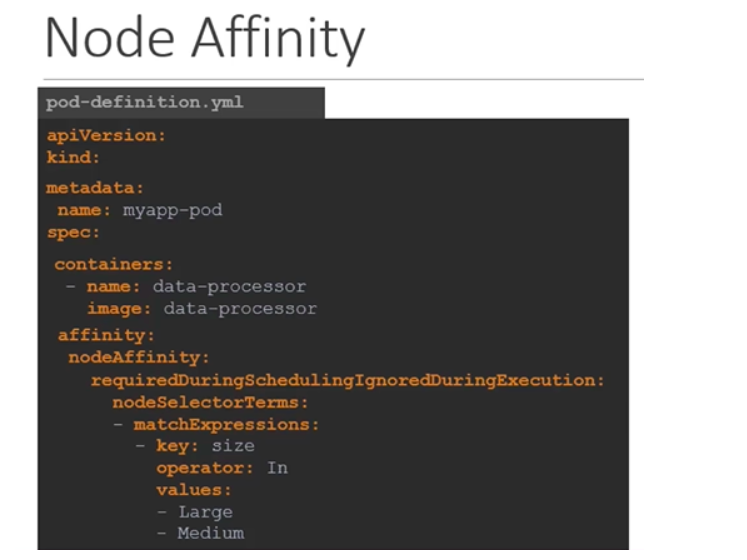
- Used for the cases where we need advanced node selection capabilities
- Much more complex than nodeSelectors
- Allows much more control on the value tagging
- NodeAffinity is matched when a pod is scheduled, but not while it's running.
- This nodeAffinity can be either required or preferred. If a pod with required nodeAffinity does not find an available node, it will not be scheduled.
- If the affinity is set to preferred and a node is not available with the requirements set, it will shcedule in another non-compliant node

### NodeAffinity Types
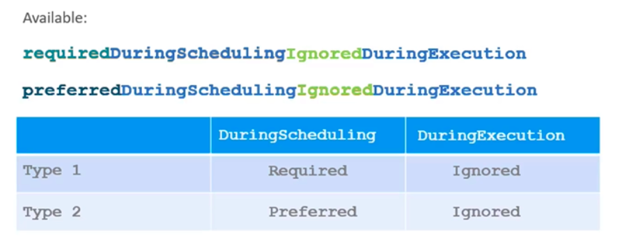
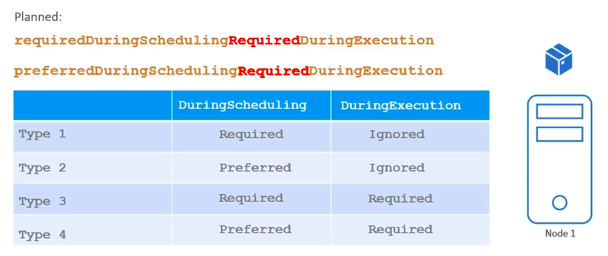

## NodeAffinity and tolerations
- Tolerations do not prevent pods from going to other nodes
- Nodeaffinity does not guarantee other pods not getting in our node
- TO guarantee exclusivity on a node for a specific workload we need to provide both Taints/Tolerations and NodeAffinity configurations.

## Resources and limits
- A node has a given amount of resources
- A pod consumes a given amount of resources from a node
- The scheduler places the pods where sufficient resources are available
- If there are insufficient resources pods will not be scheduled
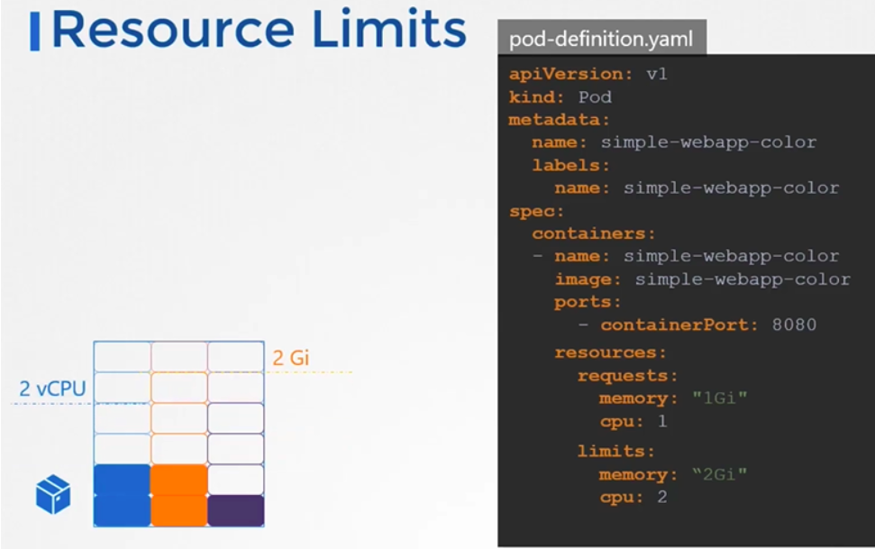
- By default, K8s assume that a pod or container within a pod requires **0.5 CPU and 256Mi of memory**. This is known as the Resource Request for a container.
- **1 CPU is 1 vCPU(thread) on AWS, 1 core in GCP or Azure or 1 hyper thread.**
- **1 k(kilobyte) = 1000 bytes and 1 ki(kibibyte) = 1024 bytes**
- Containers have **requests** (the amount of resources it wants at minimum to dedicate) and the limits (how many resources can a pod consume before it gets evicted)
- If your application within the pod requires **more than the default resources**, you need to set them in the pod definition file
- This is set under the container spec of a pod, as a resources block and a limits block
- By default, k8s sets resource limits to **1 CPU and 512Mi** of memory. We can set the resource limits in the pod definition file.
- If a container tries to use more CPU than its limit, it will be throttled
- If a container tries to use more memory than its limit, the pod will be evicted

## DaemonSets
- DemonSets, like ReplicaSets, run pods across your cluster
- A daemonSet ensures one pod is present in every node of the cluster
- This is useful for tasks like monitoring where every node gets a monitoring pod
- An example, kube-proxy, is a DaemonSet
- Solutions like WeaveNet are also a good candidate for DaemonSets
- Creating a DaemonSet is similar to ReplicaSet, but kind is DaemonSet instead of ReplicaSet

## Satic pods
- Apart from contacting the kubernetes api, the kubelet also reads manifests from `/etc/kubernetes/manifests/`
- This is independent from the rest of the cluster
- This **only allows you to create pods**. Not replica sets, or deployments for example. The kubelet works at a pod level and can only create pods
- You can see the pods or containers with `docker ps`. We do not have access to the kubectl(it works with kube-apiserver) command, as we do not have cluster access in this situation.
- The kubelet can create both kubeapi-server and static pods at the same time
- **the kubeapi-server will see static pods as other pods in the cluster, but will not be able to interact with them**
- Static pods are useful for tasks like setting up the control plane like etcd, apiserver or controller manager
- This is how kubeadm sets up a cluster, as static pods
- Static pods usually have **the node name at the end of their pod name**. This can help you **identify static pods!**

## Multiple schedulers
- The default scheduler distributes pods evenly taking into account **taints, tolerations and nodeAffinity**
- You can also write your own Kubernetes scheduler program, either replacing the default or using both at the same time
- One kubernetes cluster can have multiple schedulers
- When you create a pod you can run it using a specified scheduler
- When a cluster is deployed with kubeadm we can find the static pod declaration for the scheduler and write our own
- We can add the scheduler to a pod with the value schedulerName inside of a pod definition spec
- We can check which scheduler ran the pod with `kubectl get events`, or see the logs of a specific scheduler with `kubectl logs`
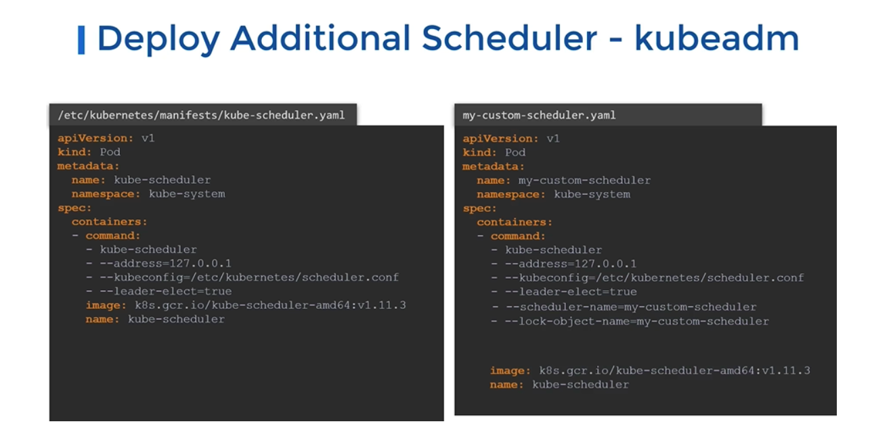
- To get multiple schedulers working you must either set **the leader-elect** option to false, in case where you don’t have multiple masters. In case you do have multiple masters, you can pass in an additional parameter to set a lock object name.

This is to differentiate the new custom scheduler from the default during the leader election process
- We create a new scheduler by modifying a copy of the current scheduler with the following configuration:
```
    - --leader-elect=false
    - --port=10282
    - --scheduler-name=my-scheduler
    - --secure-port=0
```
[!] You will also need to modify the liveness probes to HTTP and point them to the correct port for this to report it as working

# Cluster monitoring

## Resource monitoring
- Node-level metrics: number of nodes, health, cpu utilization, memory consumption
- Same for pods
- Monitoring with tools like Metrics Server
- One Metrics Server per cluster, it retrieves metrics from each nodes and pods, aggregates them and stores them in memory.
- Metrics Serve does not store the metrics on the disk and as a result you cannot see historical performance data.
- third-party solutions like Prometheus
- **cAdvisor** inside the kubelet monitors pods and sends the metrics to the Metrics Server
- You can view the info with `kubectl top node` or `kubectl top pods`

## Logging
- Pods generate logs that get stored for a container
- You can view the logs with `kubectl logs [pod name]`
- If there are **several containers inside the pod**, specify the container with `kubectl logs [pod name] -c [container name]`

# Application Lifecycle Management

## Rolling updates and rollbacks
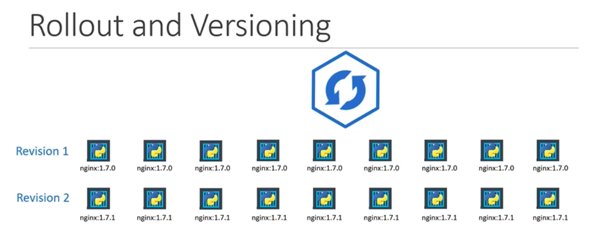
- When you create a deployment it triggers a rollout
- When the deployment changes, a new rollout(pods with the new version) starts
- That deployment change creates a **new deployment revision**, This helps keep track of the changes made to our deployment and enables us to roll back to a previous version of deployment if necessary.
- You can see the status of a rollout with `kubectl status rollout deployment/[deployment name]`
-  You can see the history of a rollout with `kubectl history rollout deployment/[deployment name]`
- The new versions of pod instances are created one by one, replacing an old one every time
- This allows us to rollout an update without interrupting service
- The two ways of deployment are **Recreate** and **RollingUpdate**. Recreate means a downtime taking down everything at once, RollingUpdate avoids downtime (the default)
- You can undo changes of a rollout with `kubectl rollout undo deployment/[deployment name]`

## ENTRYPOINT VS CMD
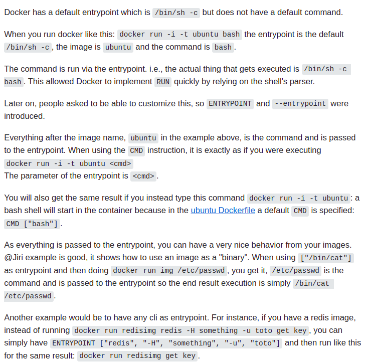

## Configure docker applications
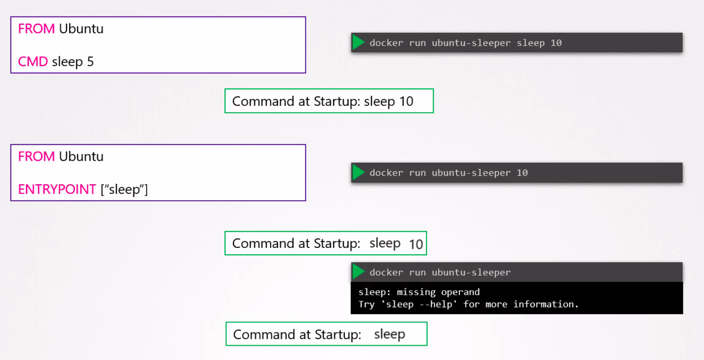
- Containers are supposed to run a specific task
- When that task is done, the container stops
- We can specify what task a container has to run in its configuration declaration
- `CMD` commands always run the same, but `ENTRYPOINT` gets command line parameters from an execution and it runs when the container starts
- In case of the **CMD** instruction the command line parameters passed will get replaced entirely, whereas in case of **ENTRYPOINT** the command line parameters will get appended.
- If we run the ubuntu-sleeper without appending the number of seconds then the command at startup will be just sleep and you get the error that the operant is missing. So how do we configure a default value for the command ?
- If one was not specified in the command line that's where you would use both **ENTRYPOINT** as well as the **CMD** instruction.

- In this case the command instruction will be appended to the entry point instruction so at startup the command would be `sleep 5`.
- You can override the entrypoint command that is inside the dockerfile with the `--entrypoint` docker argument

## Commands and arguments for pods
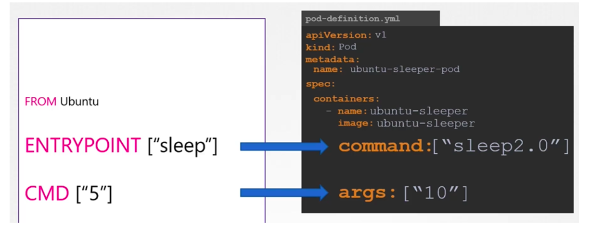
- Anything that is appended to the docker run command will go into the `args` property of the pod definition file in the form of an **array**.
- The `command` field corresponds to the `ENTRYPOINT` instruction in the Dockerfile
## Environment variables
- We can use the env array property on a pod definition spec to pass environment variables to a container
- We use this for ConfigMaps and Secrets too, with a reference to where the value comes from

## ConfigMaps

- ConfigMaps are groups of **key-value pairs** that we inject into pods as environment variables
- They can be created both declaratively or imperatively
- After creating a ConfigMap we pass it to a pod with the spec `object envFrom` as a `configMapRef`
- We can pass multiple ConfigMaps to a single pod
- We can also add an entire ConfigMap as environment variables for a pod, not just one by one
- ConfigMaps can also be attached as volumes

## Secrets
- We should avoid hardcoding credentials into applications
- An example alternative is to store them as environment variables inside of a ConfigMap
- For this we use Secrets, which are similar to ConfigMaps, but they are stored in an encoded or hashed format like base64.
- First we create a secret, either imperatively or declaratively, and then we attach it to a pod.
- This is done similarly to ConfigMap attachment, but we use `secretKeyRef` instead
- Secrets are encoded, not encrypted
- Kubernetes takes some precautions to protecting secrets, **like only sending the secrets to nodes that require them, never writing them to disk, and deleting the secret once it isn't needed anymore**

## Multi-container pods
- Sometimes we need multiple tasks running in a single pod, like a **logging agent** and a **webserver**
- With Multi-container pods share the same **lifecycle** which means they are created together and destroyed together 
- **Also they share network space and storage volumes**
- With this way we do not have to establish volume sharing or services between the pods to enable communication between them
- To add a second container to a pod definition spec, just add a new container definition to the list
### Sidecar Container
A Sidecar container is a second container added to the Pod definition
#### Scenario: Log-Shipping Sidecar
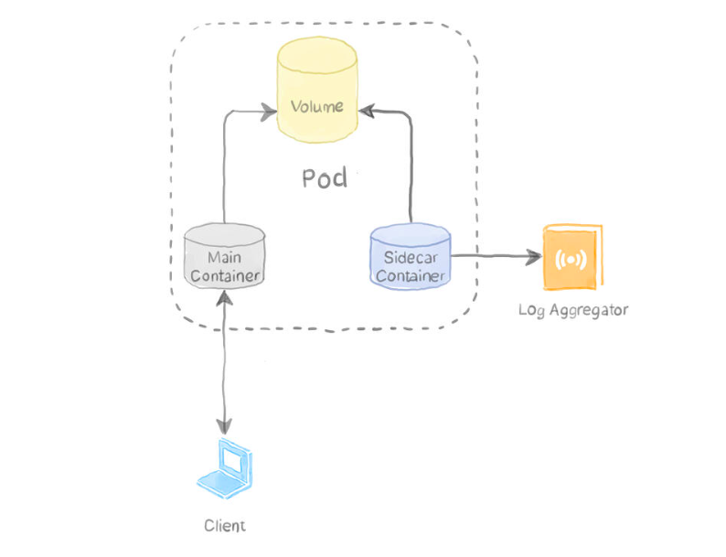</br>
In this scenario, we have a webserver container running the nginx image. The access and error logs produced by the webserver are not critical enough to be placed on a persistent volume. However, developers need access to the last 24 hours of logs so they can trace issues and bugs. Therefore, we need to ship the access and error logs for the webserver to a log-aggregation service. </br>
Following the separation of concerns principle, we implement **the Sidecar pattern** by deploying a second container that ships the error and access logs from nginx. Nginx does one thing, and it does it well; serving web pages. The second container also specializes in its task; shipping logs. Since containers are running on the same Pod, we can use a shared emptyDir volume to read and write logs. 

## InitContainers
- Sometimes we need a container in a pod to just run a task and stop on boot time
- This is done by InitContainers
- InitContainers **run sequentially** when a pod starts
- If InitContainers fail, the pod will restart the creation process
- These are declared under the initContainers array on the pod spec, alongside the Containers array
- Example: Wait for some time before starting the app container with a command like: `sleep 1000`

# Cluster maintenance

## Operating system upgrade
- Sometimes you need to take nodes out of the cluster to perform maintenance
- Depending on how we deploy the pods, pulling down a node could affect service
- If a node is down **more than 5 minutes**, pods on a node are considered down and will be recreated as they will **be evicted**
- When the cluster comes back up, it will come back up empty and ready to schedule new pods
- To be sure that we will not lose service, we drain(move all the pod to other nodes in the cluster) the workloads from the node before removing it from the cluster (cordon and drain the node)
- **Cordon** will not allow new pods to schedule into that node, Unlike drain it does not terminate or move the pods on an existing node
- **Drain** will remove the current pods on that node **and cordon it**
- When the node is back up, we need to uncordon it so it can get pods scheduled to it
- Nodes cannot be drained if they are running pods not managed by a **daemonset**, **replicaset**, etc, which would be lost on a drain eviction. Forcing is possible, but not recommended

## Kubernetes Software Versions

### Kubernetes Version
**We can see the kubernetess version that we installed**</br>
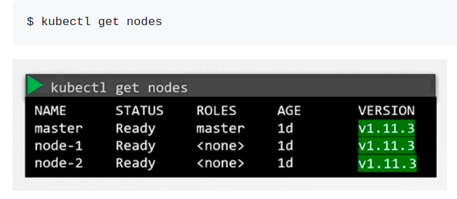</br>

### Kubernetes Software Releases
**Kubernetes follows a standard software release versioning procedure**: You will also see **alpha** and **beta** releases. </br>
All the bug fixes and improvements first go into an **alpha** release. **The features are disabled by default and maybe buggy.**</br>

From there the code make their way to **beta** release where the code is well tested. **The new features are enabled by default.**</br>

And finally they make their way to the main **stable release**.</br>

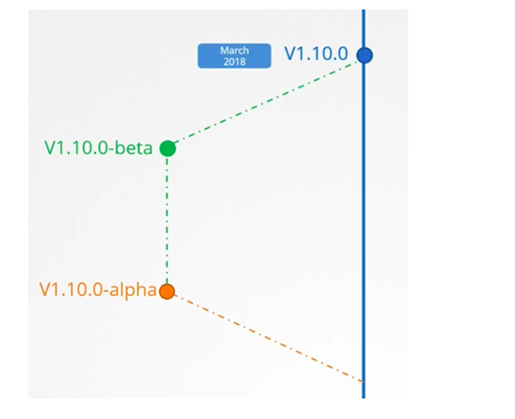</br>
### Kubernetes Components
Downloaded package has `all the kubernetes components` in it except `ETCD Cluster` and `CoreDNS`as they are seperate projects.</br>

The `ETCD Cluster` and `CoreDNS` servers have their **own** versions as they are **separate projects**.</br>


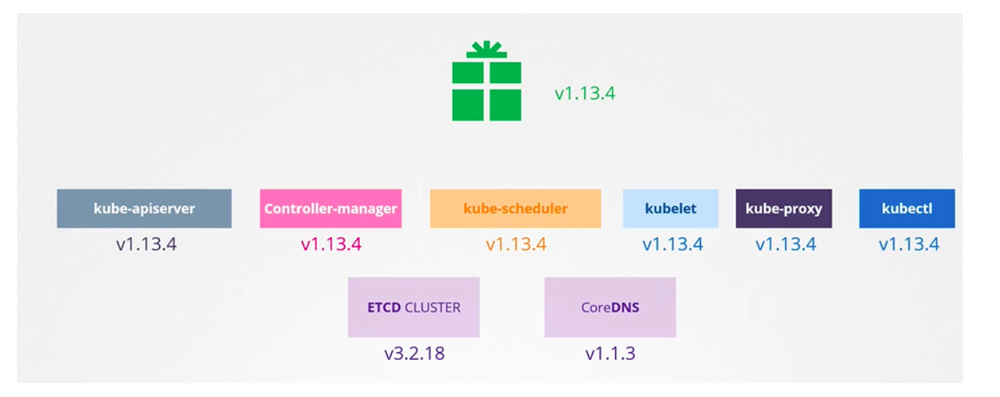

## Cluster upgrade
- It is not mandatory that all kubernetes components are all the same version
- Elements cannot be at a **newer** version than the **kube-apiserver**
- **controller-manager** and **kube-scheduler** can be **1 version behind**
- **kubelet** and **kube-proxy** can be **2 versions behind**
- **kubectl** can be one version **over** or **under**
- This allows us to upgrade the cluster by parts without interrupting service
- 3 versions are supported at a time by kubernetes: **the current version and the two earlier ones**
- The recommended approach is upgrading **one version at a time**
- We can upgrade the cluster with `kubeadm upgrade [plan/apply]`
- First we upgrade the master nodes, then we upgrade the workers
- While the master is down for upgrades, the cluster is still running workloads on worker nodes, we just can't make changes(we can't use kubectl)
- When the master is upgraded we can upgrade workers one by one so we keep service unaffected
- We can also add new, already upgraded nodes to the cluster and cordon the old ones, move the workloads to the new nodes and remove the old nodes
- remember the kubelet runs on each node, so you need to ssh into the node to upgrade it
- After an upgrade we need to mark nodes as scheduleable again

## Backup and restore
- You need to back up your cluster in terms of service configuration, etcd state and persistent volumes
- Save a copy of the resource configuration files in something like github
- You can use(query the kube-api server) `kubectl get all -A -o yaml` and save the output to a file as backup
- You also have third party solutions like Velero
- Backing up etcd is necessary to keep track of the state of the kubernetes cluster
- You can back up the etcd database folder on your master node
- You can also use etcd's built-in snapshot tool to back up the database

# Kubernetes security

## Security primitives
- First step is securing the cluster infrastructure, like node access only `SSH key based authentication(passwordless)`
- **First line of defense** at a cluster level is **securing the kube-apiserver**
- `Authentication`: Who can access the API Server is defined by the Authentication mechanisms: : `usernames and passwords`, `usernames and tokens`, `certificates` and `service accounts`
- `Authorization`: Once they gain access to the cluster, what they can do is defined by authorization mechanisms.


- `TLS Certificates`: All communication with the cluster, between the various components such as the ETCD Cluster, kube-controller-manager, scheduler, api server, as well as those running on the working nodes such as the kubelet and kubeproxy is secured using `TLS encryption`.
- By default all pods can access all other pods, we can restict access between them using **network policies**

## Authentication
- Different users that may be accessing the cluster security of end users who access the applications deployed on the cluster is managed by the applications themselves internally.
- So, we left with **2 types of users**
	- `Humans`, such as the `Administrators` and `Developers`
	- `Robots` such as other `processes/services` or `applications` that require access to the cluster.

- Kubernetes does not natively manage **user accounts**, it uses external tools like `certificates` or `login systems like LDAP`
- Kubernetes does manage application access with `Service Accounts`
- **All user access is managed by the kube-apiserver**
- Users access the cluster using `static passswords` or `token files`, `certificates`, or through `external identity services like LDAP`
### Password or token-based authentication
- Deprecated in Kubernetes 1.19
- The first option is creating a csv file with users and passing it as an option to the kube-apiserver for basic authentication
- To authenticate to the cluster when making an API call pass the user and password to the request and the cluster will answer with the response
- The same format is used for token-based authentication
- **This authentication system is not recommended as it is unencrypted and static**

### Certificate-based authentication
#### Types of Certificate
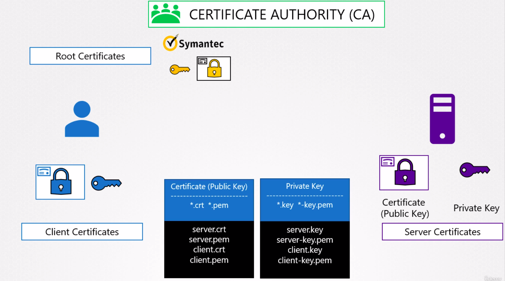
- Certificates with public key are named **.crt** or **.pem**
- Private keys are usually with extension **.key** or **-key.pem**
- Types of Certificates:
	- **Server certificates**: configured on servers
	- **Root certificate(CA Certificate)**: CA own set of public and private key pairs that it uses to sign server certificates
	- **Client certificates**: configured on the client
#### Certificates Groups
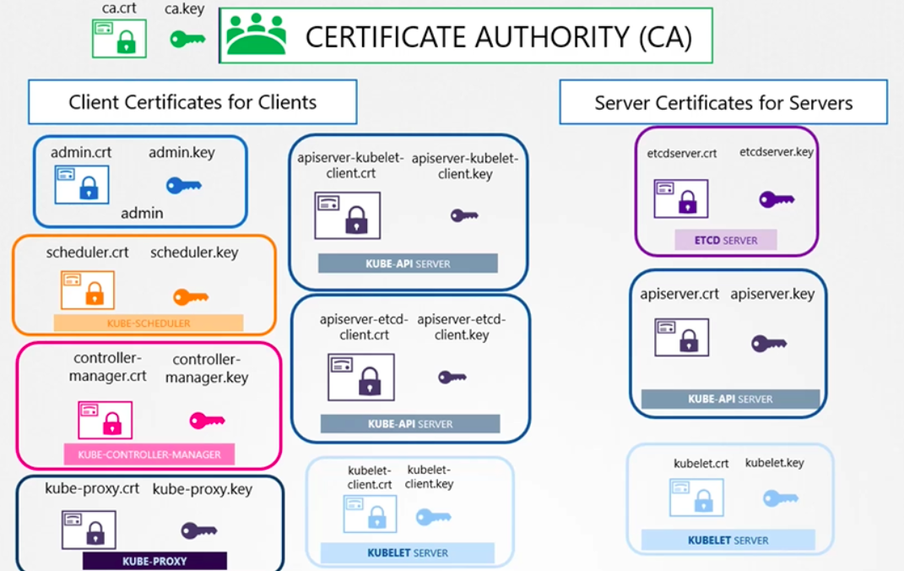

#### Communication using Certificates
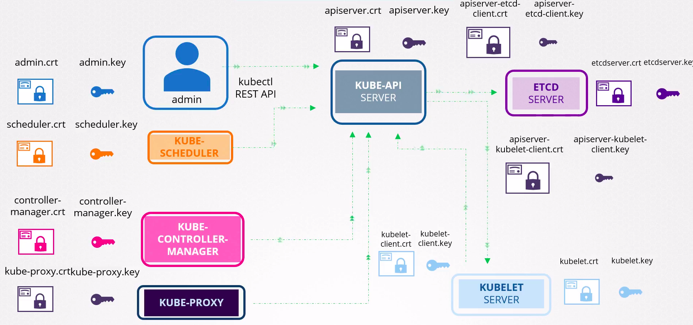
- All communication within the cluster and with the user is done through TLS
- Each cluster component has its own key pair: kube-apiserver, etcdserver, kubelet
- Each user needs its own certificate pair to access the `kube-apiserver` through kubectl. Same for `kube-scheduler`, `kube-controller` manager and `kube-proxy`, which act just like a client
- You need a Certificate Authority for the cluster, which has its own key pair to sign other certificates

 #### Certificate Creation
 
- Generating certificates is done with tools like **EasyRSA**, **OpenSSL** or **CFSSL**
- First we generate a certificate for the CA, Going forward for all other certificates, we will use the CA provate key to sign all of them.
- Getting a certificate has 3 steps: 
	- **1:** generating the certificat(generating a private key)
	- **2:** generating a signing request(using the private key)
	-  **3:** signing the certificate(using the private key of the CA)
- Add values to the CSR to add the **user certificate to certain groups(the user will get the group permissions after the certificate generation)**, like the **administrators group**
- You can add these certificates to a **Kubeconfig file** to avoid passing them as values to every request
- Any user requests go through the kube-apiserver and need to authenticate against it
- the kube-apiserver certificate needs to accept any name that the kube-apiserver will be referred as: the IP, the local name, or the fully qualified domain name 
- Kubelet crtificates are named after the node they run on
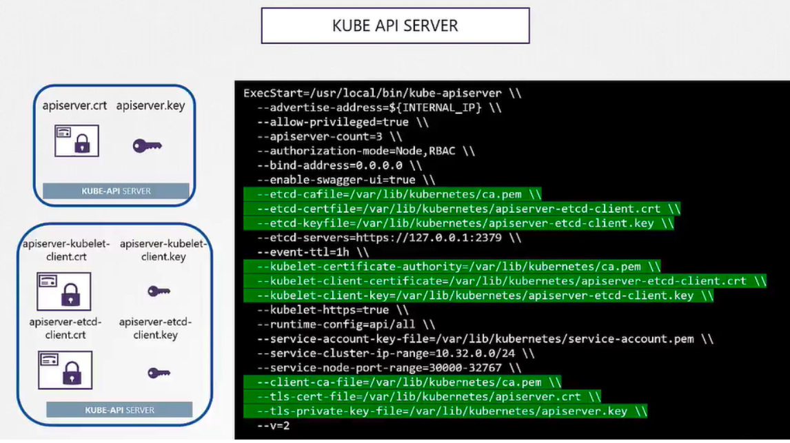
- Add the `CA certificate`, `generated certificate` and the `private key`  to the file inside `etc/kubernetes/manifests/`of each `commponents``
- **Certificates can be viewed on the cluster on the locations specified on the kube-apiserver pod definition file (if it was set up with kubeadm), generally /etc/kubernetes/manifests/kube-apiserver.yaml**

## View Certificate Details
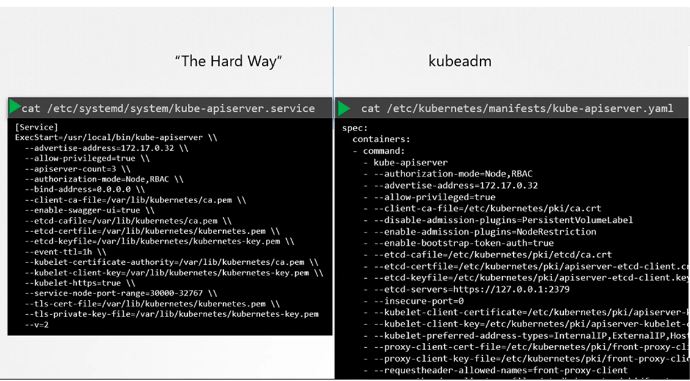
- Different solutions available of deploying a kubernetes cluster and they use different methods to generate and manage certificates
-  If we deploy a kubernetes cluster from scratch we generate all the certificates by yourself, we deploy all the components as **native services on the nodes**
-  If we rely on an automated provisioning tool like **kubeadm**, it takes care of automatically generating and configuring the cluster, It deploys these **as PODs**.

## Certificate API
- Whoever has access to the **CA files** has access to creating certificates for the cluster
- These files should be very well protected. They are usually on the master node
- To avoid doing this manually Kubernetes has a `certificate signing API` to renew them through the API with kubectl commands
- You send a CSR directly to kubernetes, When the administrator receives a CSR instead of logging onto the master node and signing the certificate
- The admin creates a Kubernetes API object called **CSR**
- This CSR is created on the cluster as an object using a yaml manifest
- Administrators can see kubernetes csr's and can approve them or deny them as needed
- This generated certificate can then be retrieved from the resulting certificate object's yaml
- All certificate-related tasks are handled by the **kube-controller manager(It has controllers in it called as csr-approving, csr-signing)**

## KubeConfig
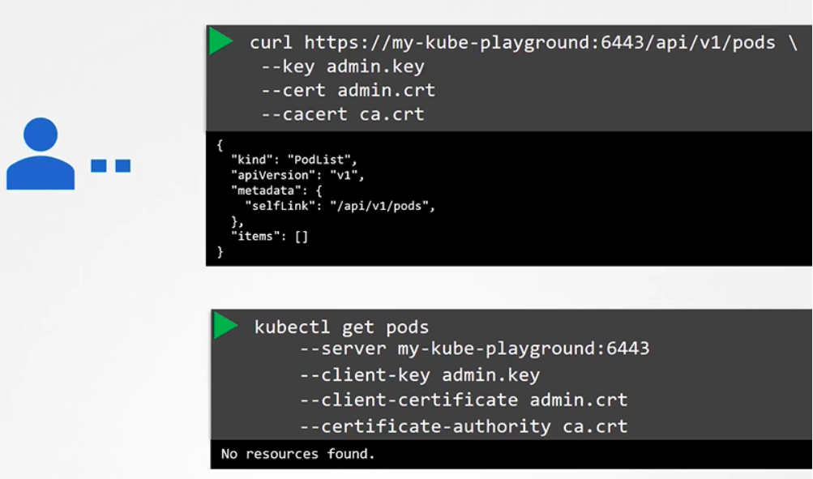
- Client uses the **certificate file** and **key** to query the kubernetes **Rest API** for a list of pods using curl or using **kubectl**.

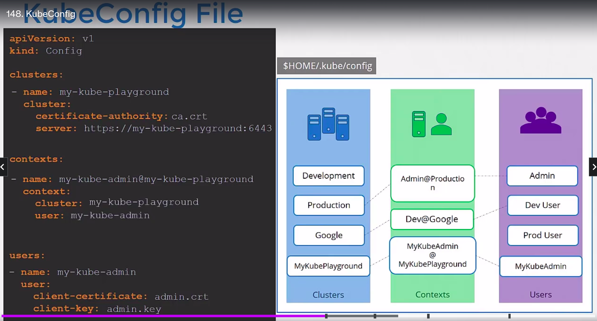
- KubeConfig files are used to authenticate against a specific Kubernetes cluster
- This file is stored in a yaml format with 3 sections: clusters, contexts and users
- **Clusters** specifies the kubernetes clusters that the kubeconfig file knows about
- **Users** specifies the users you can use(they have different privileges on different cluster)
- **Context** gets the last 2 together, specifying which users can you use on which clusters
- You can view your kubeconfig file with `kubectl config view`
- You can specify which kubeconfig file to use when running a kubectl command
- You can use `kubectl config use-context [context name]` to change between cluster contexts
- You can configure kubectl to switch to a **specific namespace** inside of a context when switched
- Certificates can be specified either as a **file path** or as a **base64 data string**

## API groups
### API Groups

 The kubernetes API is grouped into multiple such groups based on thier purpose. Such as one for `APIs`, one for `healthz`, `metrics` and `logs` etc.
### API and APIs
- Separated in the core **(/api/v1)** and named groups **(/apis)**
- Core(Where all the functionality exists) controls namespaces, nodes, persistent volumes, pods...
- Named( More organized and going forward all the newer features are going to be made available to these named groups) controls apps, extensions, networking, storage, authentication...
- Each resource has a set of actions that we can perform
- Accessing the API requires authentication and authorization to the resources
- We can use kubectl proxy to make a curl endpoint that accepts requests using our kubeconfig file

## Authorization
- Once a user has access to a cluster through authentication, we control authorization by specifying what that user can do
- An example is not allowing a developer to delete nodes on a cluster
- Kubernetes supports several authentication mechanisms: Node, ABAC(Attribute based authorization), RBAC(RoleBAC) and Webhooks
- **Node-based authorization** allows privileges for the Kubelet to work on its resources
- **ABAC is attribute-based authoritzation**: which allows a certain user to use a set of permissions defined by a policy. This is done for each user or group, and each time we make changes to it we need to restart the kube-apiserver
- **RBAC** associates permissions to a specific role and we assign the users and groups to the role, and when a role is modified it is immediately applied to all users associated to it
- **Webhook** allows external authorization management with third party tools like OpenPolicyAgent
- If not specified Kubernetes is set to always allow requests

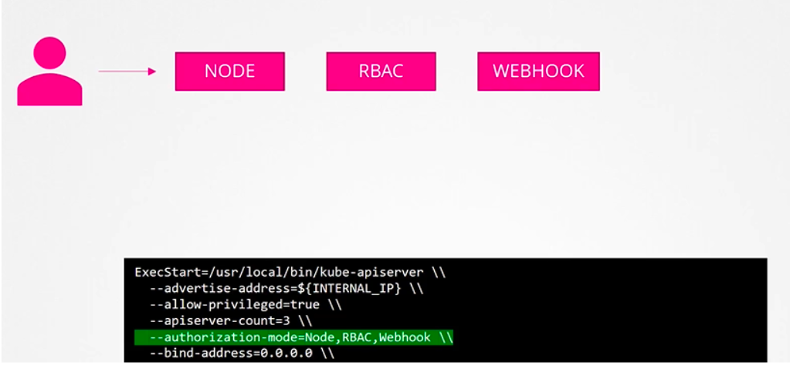
 On the kube-apiserver configuration file we specify a list of **authorization managers**, and a request will follow them in order. If a request is denied, it jumps to the n**ext authorization validator in the chain**

## Role-Based Access controls
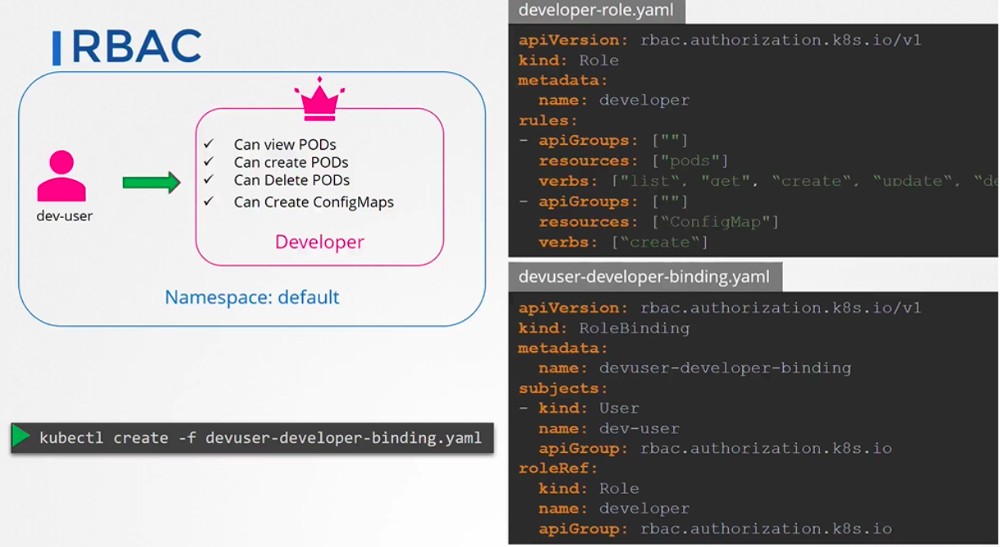
- Roles are objects defined in Kubernetes
- We define these roles in a yaml configuration file
- This file holds the role name, what resources it applies to, and what you can do to those resources if you're part of that role
- Each role has 3 rule sections: apiGroups, resources and verbs
- You can add multiple rules for a single role, like allowing to create, list, get and delete pods, but only allow to list configmaps

## Roles and RoleBindings
- After creating the role, we link a user or group to a role with a RoleBinding object
- On a RoleBinding we specify the user or group as a subject or subjects in a list, and the roleRef referencing what role they will be linked to
- **RoleBindings are scoped to the namespace where the roleBinding is created**
- you can list these with `kubectl get roles` and kubectl get rolebindings
- You can also describe roles and rolebindings to get more information
- You can use `kubectl auth can-i [command]` to check if you have permissions to run tasks, like kubectl auth can-i create deployments
- Administrators can impersonate other users to check permissions by adding `--as [user]` to the command above
- You can give users access **to specific resources rather than entire resource lists**, like only allowing read access to a pod named nginx-ingress by adding `resourceNames` Field

## ClusterRoles and ClusterRoleBindings
- **Roles** and **Rolebindings** are **namespaced** meaning they are created within namespaces.
- Can you group or isolate nodes within a namespace?
	- No, those are cluster wide or cluster scoped resources. They cannot be associated to any particular namespace.
- The resources are categorized as either `namespaced` or `cluster scoped`
- `Cluster Roles` are roles except they are for a `cluster scoped resources`.
- Example of cluster scoped resources are `nodes`, `persistent volumes`, `namespaces` or `certificate signing requests`
- A **cluster-admin** role can add and delete nodes
- A **storage-admin** role can add and delete storage volumes and volume claims
- The process is the same as earlier: we create a clusterRole and assign users to it with a ClusterRoleBinding
- We can create a clusterole for **namespace** resources also, but the user will have access to these resources across **all namespaces**.

## Service accounts
- Kubernetes has 2 types of accounts: `User` and `Service accounts`
- `User accounts` are for humans, like administrators or developers
- `Service accounts` are for programs to access API resources like prometheus pulling performance metrics from the Kubernetes API
- ServiceAccounts use a token to access the cluster
- The token is created when the ServiceAccount is created and is stored as a secret
- **if the application is hosted on the k8s cluster**: Secrets for ServiceAccounts can be automatically mounted  as a volume inside the pod to be used by applications, no need to create a **service accounts** 
- That way, the token to access the Kubernetes API is already placed inside the pod and can be easily read by the application.
- Each namespace has its default service account named **default**
- When a pod is created, The **default service account** and its **token** **are automatically mounted to that pod as a volume mount**
- The default service account is **restricted**, It only has permission to run **basic common API queries**.

## Securing image
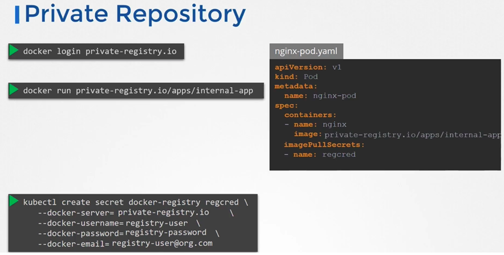
- By default Kubernetes pulls images from the docker registry(Example: **Image: nginx** is in fact **image: docker.io/library/nginx** where library can be replaced with the docker user account)
- We can also use a private registry to pull images from as you may want to make your images private
- Kubernetes has a special **secret type named docker-registry** which allows kubernetes to pull images from private registries
- This needs to be attached to the pod as imagePullSecret so it can pull images from the private registry for that pod

## Security contexts
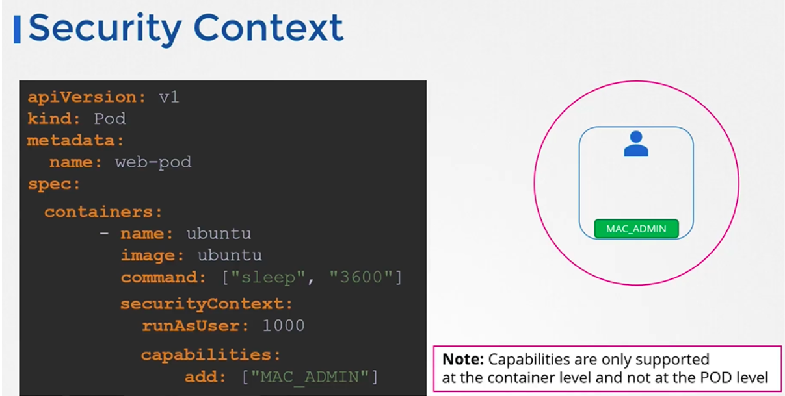
- Docker has the ability to configure security contexts for the containers, like user they run as or kernel capabilites
- These can also be configured on Kubernetes
- They can be configured at a c**ontainer level** or at a **pod level**
- If configured at a container level, they will override the pod-level settings
- This configuration is added to the container or pod speficication under the securityContext label with tools like runAsUser to set the user to run as
- Capabilities, like setting NET_ADMIN are only supported at the container level, not at the pod level

## Network policies
- By default all pods in the cluster can communicate with any other pod
- Network policies are objects in Kubernetes that limit network access to and from pods(like security group in AWS)
- Network policies are attached to one or more pods
- We link network policies to pods based on **labels** and **selectors**
- first we specify the ingress rule on the network policy
- When the network policy is created we tag the pod in a way that it will link the policy to the pod
- Network policies are enforced by your networking provider in the cluster
- Not all support network policies. For example, Flannel does not support network policies
- You can still create network policies even if they are not applied but your network provider

# Storage

## Storage in Docker
In this section, we will take a look at docker Storage driver and Filesystem [Storage in Docker](https://github.com/raghebbenhamouda/certified-kubernetes-administrator-course/blob/master/docs/08-Storage/03-Storage-in-Docker.md)
## Volume in Docker
In this section, we will take a look at docker Storage driver and Filesystem [Storage in Docker](https://github.com/raghebbenhamouda/certified-kubernetes-administrator-course/blob/master/docs/08-Storage/04-Volume-Driver-Plugins-in-Docker.md)
## Container Interfaces
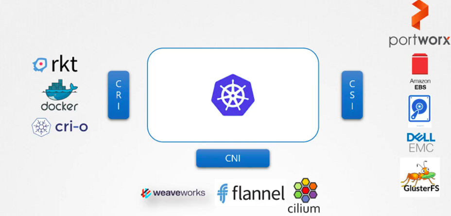
### Container Runtime Interface(CRI)
- The container runtime interface is a standard that defines how an orchestration solution like k8s would communicate with a container runtime like Docker.
- If any new container runtime interface is developed, they can simply follow the CRI standards.

### Container Networking Interface(CNI)
- The container networking interface was introduced, to extend support for different networking solutions

### Container Storage Interface(CSI)
- The container storage interface was developed to support multiple storage solutions
- It allows any container orchestration tool to work with any storage vendor(Amazon EBS)


## Volumes in Kubernetes
- Docker containers do not have persistent storage by default
- If persistent storage is attached, we can persist data between containers
- Same applies to Kubernetes pods
- We create a volume(inside a node) and mount this volume to the container to store data and make it persistent
- Kubernetes supports several **external distributed storage** solution like **EBS**, **CEPH** or **S3**
- Availability depends on where you build your cluster

## Persistent volumes


- In the large evnironment, with a lot of users deploying a lot of pods, the users would have to configure storage every time for each Pod.
- Whatever storage solution is used, the users who deploys the pods would have to configure that on all pod definition files in his environment. Every time a change is to be made, the user would have to make them on all of his pods.
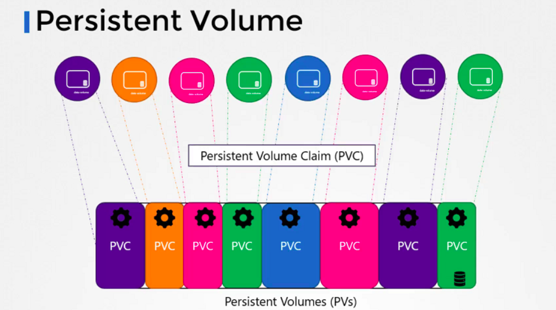
- A Persistent Volume is a **cluster-wide** pool of **storage volumes** configured by an administrator to be used by users deploying application on the cluster
- The users can now select storage from this pool using `Persistent Volume Claims`
- First we generate a persistent volume with a yaml file specifying name, access mode, capacity and storage type

## Persistent volume claims
- After we have created a persistent volume we need a persistent volume claim to match this storage request with a persistent volume
- **Every persistent volume claim matches a single persistent volume**
- A persistent volume cannot have 2 persistent volume claims, **it is a 1 to 1 relationship**(No other claims can utilize the remaining capacity in the PV)
- If there are no PV available the PVC will remain in a **pending** state until newer PV are available to the cluster
- After deleting a persistent volume claim, by default, a persistent volume will stay unless deleted by an administrator, and stays unavailable to use
- We can configure it to clear the data and make the persistent volume available again if the persistent volume is deleted

## Storage classes
- We discussed about how to create Persistent Volume and Persistent Volume Claim and We also saw that how to use into the Pod's volume to claim that volume space.
- We created Persistent Volume but before this if we are taking a volume from Cloud providers like GCP, AWS, Azure. We need to first create disk in the Google Cloud as an example.
- We need to create manually each time when we define in the Pod definition file. that's called Static Provisioning.
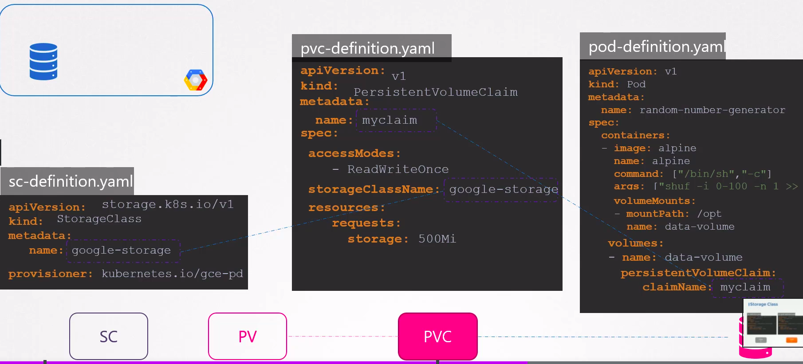
- No we have a `Storage Class`, So we no longer to define Persistent Volume. It will create automatically when a Storage Class is created. It's called `Dynamic Provisioning`.
- For each storage class we can use different types of drives that these providers offer. This depends on what your cloud provider offers

# Networking

## Switching
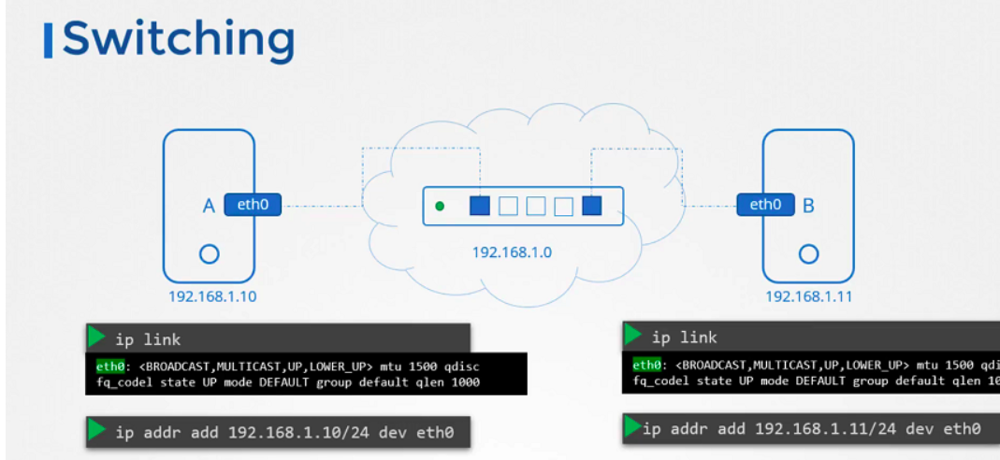
- How computer **A** connect to **B**: we connect them to a `switch`, and the switch creates a `network` containing the two systems.
- To connect them to a switch. we need an `interface` on each host, `physical` or `virtual`, depending on the host.
- `ip link`: list and modify interfaces on the host
- `ip addr`: show the ip addresses assigned to those interfaces
- `ip addr add 192.168.1.10/24 dev eth0 `: to set IP addresses on the interfaces.

## Routing
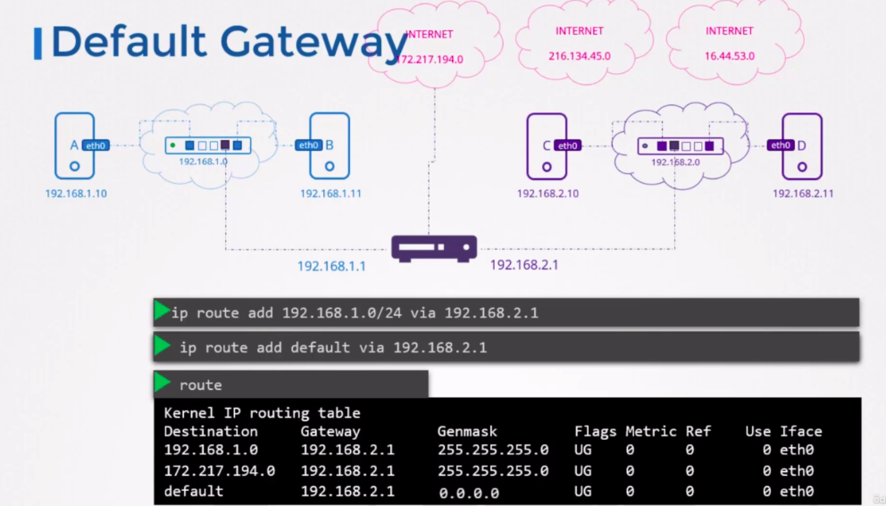
- A `router` helps connect two networks together.
- It gets **two IPs** assigned, **One on each network**
- `ip route`: to view the routing table
- `ip route add 192.168.1.0/24 via 192.168.2.1`: to add entries into the routing table.

## Setup a Linux Host as a Router
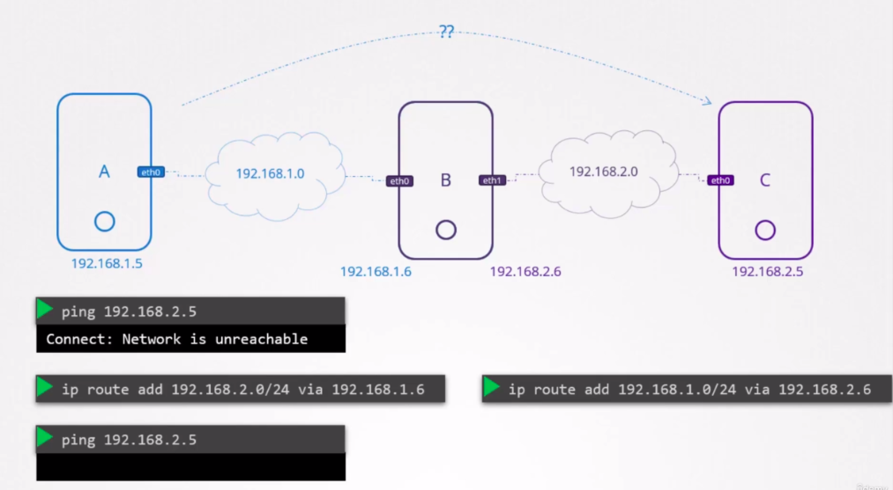
- How to get **C** to reach **A** ?
- We need to tell host A that the gateway to **network two** is through `host B` and we do that by adding a routing table entry.
- `cat /proc/sys/net/ipv4/ip_forward`:  check if IP forwarding is enabled on a host( Example: **eth0 forward to eth1**)
- **PS**: change made using these commands are **only valid till a restart**. If you want to persist these changes you must set them in the /etc/network/interfaces file

## DNS
[DNS in Linux](https://github.com/raghebbenhamouda/certified-kubernetes-administrator-course/blob/master/docs/09-Networking/03-Pre-requisite-DNS.md)

## CoreDNS
In this section we will see how `to configure a host as a DNS server` [CoreDNS](https://github.com/raghebbenhamouda/certified-kubernetes-administrator-course/blob/master/docs/09-Networking/04-Pre-requisite-CoreDNS.md)

## Network namespaces
### Process Namespace
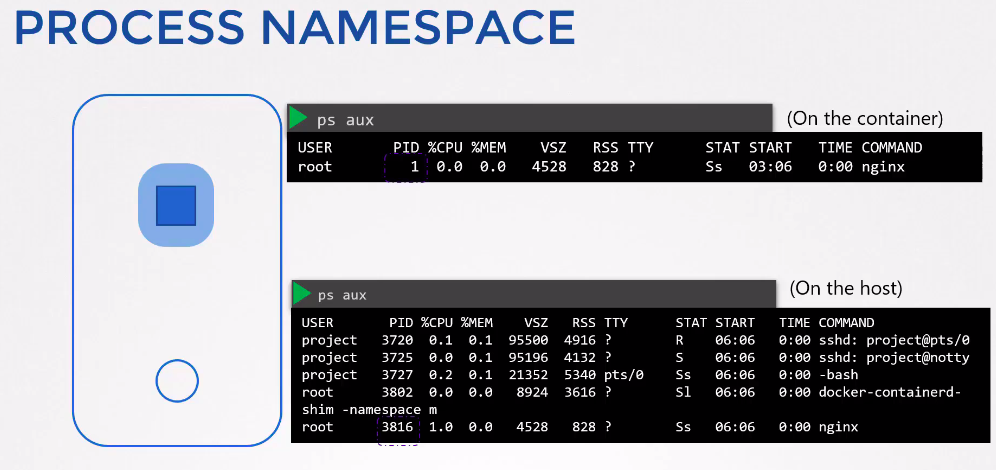
-  Containers are **separated** from the `underlying host` using **namespaces**.
-  Namespaces: If the host was a house, then namespaces are the rooms within the house that you assign to each of your children.
- The room helps in providing privacy to each child. Each child can only see what's within his or her room.
- However, as **a parent**, you have **visibility** into all the rooms in the house as well as other areas of the house.
- If we wish, you can establish **connectivity** between **two rooms** in the house.
- When we create a container, we want to make sure that it is isolated, that it does not see any other processes on the host or any other containers.
- So we create a **special room** for it on our **host** using a **namespace**.
- As far as the container is concerned, it only sees the processes run by it and thinks that it is on its own Host.
- The **underlying host** has visibility into all of the processes, including those running inside the containers.

### Network Namespace
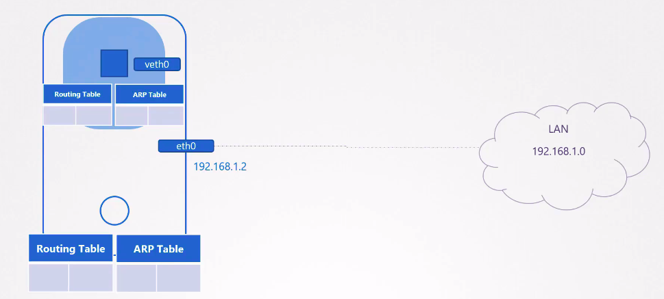
- Used to implement network isolation between elements like containers 
- A network namespace cannot see what happens in other namespaces unless configured, it  can have its own `virtual interfaces`, `routing and other tables`.
- We can connect different namespaces if we want to
- There is a parent process able to see information in all namespaces
- Every `host` in a `namespace` has its own **routing table** and **ARP table**, **independent** from the **parent host**
- Interfaces are different for every network namespace. We have a loopback interface for each network namespace

### Connect two Network Namespace Using Virtual Connection

- We can connect two network namespaces with a `virtual connection`(virtual ethernet cable with tow interfaces) to which we will assign IP addresses
- We can also create virtual elements like Vswitches(an interface for the host and a switch for the namespace) to connect interfaces on different namespaces

### Connect Network Namespcaes using Linux Bridge
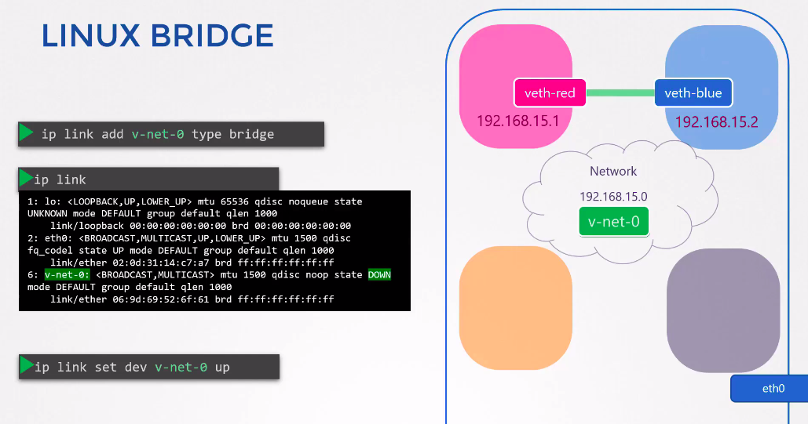
- We create a **virtual network** inside your host
- To create a network you need a switch. So we need a **virtual switch**, then we connect the namespaces to it.
- We add a new `interface` to the host using the **iplink** command with the type set to `bridge`
- For our host , it is just **another interface**


- To make this virtual network reachable from the host we need to assign it an IP address
- This entire network is still **private** and restricted within the **host** within the **namespaces**
- The only door to the outside world is the **eth0** Ethernet port on the host
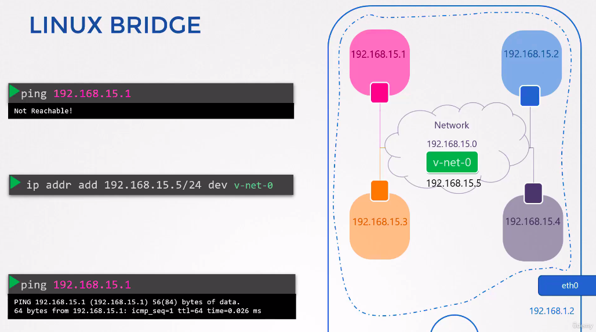
- So how do we configure this bridge to reach the LAN network through the Ethernet port?
### Network Namespce Commands
- `ip netns add`: to creat a network namespace
- `ip -n blue link `: list interfaces that belong to **blue namespace**
- `ip link add veth-red type veth peer name veth-blue`: to create the **cable(virtual connection)** 
- `ip link set veth-red netns red` : attach each interface to the appropriate namespace
- `ip addr -n red add 192.168.15.1 dev veth-red`: to assign ip to a namespace(red)

## Docker networking
- Docker containers have their own `network namespace`(one network namespace for each container)
- We have many options for docker networking:
 	- `none`: the container is not attached to any network 
 	- `host network`:the container is attached to the **host’s network**(there is no network isolation between the host and the container)
 	-  `Bridge`: an i**nternal private network** is created which the docker host and containers attach to. The network has an address `172.17.0.0`
by default and each device connecting to this network get their own internal private network addresson this network
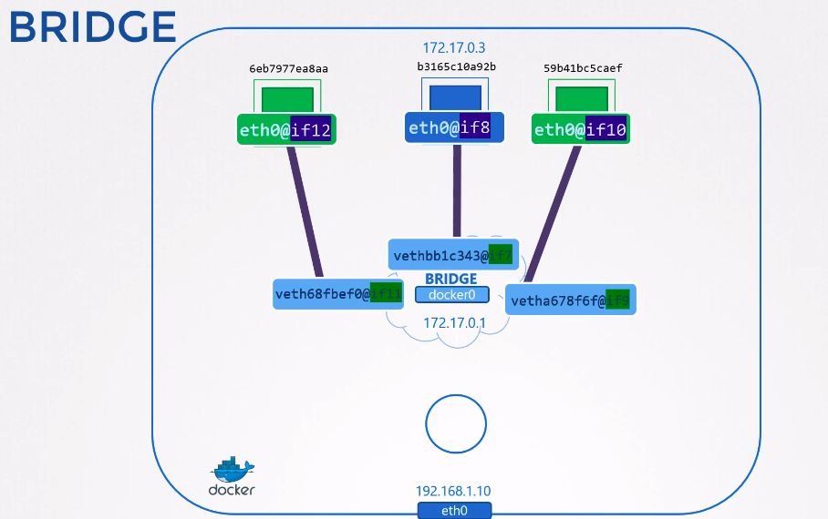
- When a c**ontainer is created**:
 	-   **a bridge network namespace** is created on the host
 	-   Creates a **pair of interfaces**
 	-   Attaches one end to t**he container** and another end to the bridge network

- We can map host ports to container ports to make program available from outside the docker host

## Container Networking Interface
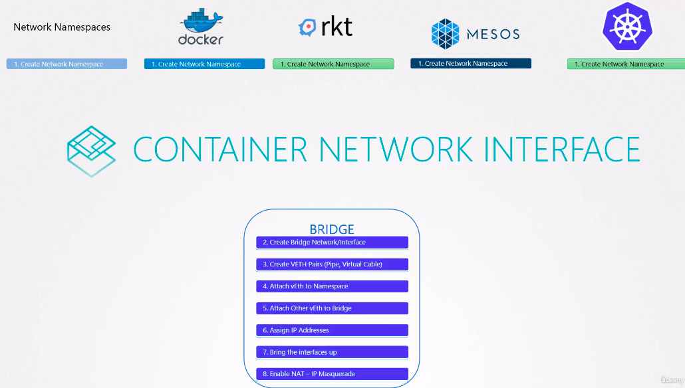
- Kubernetes creates a **network** that connects all the nodes together
- CNI defines the rules a networking provider needs to support in terms of API calls to standardize interaction with any container management tool that supports the CNI standard
- CNI is a set of standards that define how programs should be developed to solve networking challenges in a `container runtime environment`
- The programs are referred to as `plugins`
- In this case bridge program that we have been referring to is a plugin for CNI
- CNI defines how the plugin should be developed and how container run times should invoke them
- CNI specifies that it is responsible for **creating a network namespace for each container**
- This middle layer allows any supported network manager to work with any supported container management software interchangeably
- CNI specifies a set of tasks a **networking plugin has to support when interacting with the CNI API**
- **Docker does not support CNI**, it follows its own standard, and thus external network plugins like Flannel do not work with Docker
- Kubernetes with docker creates containers without networking, It then invokes the configured CNI plugins who takes care of the rest of the configuration

## Cluster networking
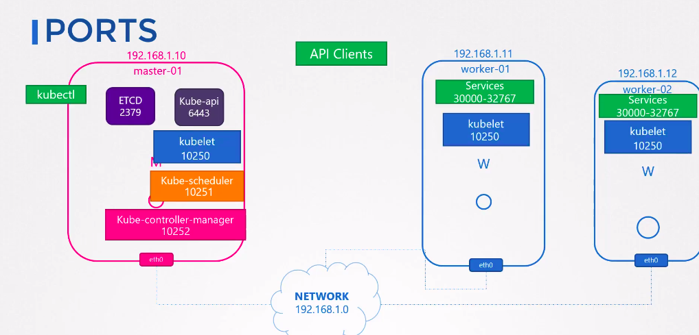
- Each node must have at least 1 interface connected to a network. Each interface must have an address configured.
- The `master node` on a cluster needs to accept requests for the api-server on port `6443`
- Any node that's running a `kubelet` needs to allow connections to port `10250`
- Additionally the master needs to allow access to port `10251` and `10252` for kube-scheduler and kube-controllermanager respectively
- Worker nodes require ports `30000-32767` for services to be open
- `etcd server` listens on port `2379`
- If we have `HA etcd `we need `2380` for etcd clients to communicate with the other master nodes

## Pod networking
- These are challenges that Kubernetes expects you to solve: 
	- How are the pods addressed?
	- How do they communicate with each other?
	- How do you access the services running on these pods `internally` from within the cluster as well as `externally` from outside the cluster?
- As of today, Kubernetes **does not come** with a `built-in` solution for this. It expects us to implement a `networking solution` that solves these challenges
- The nodes are part of an `external network` and has IP addresses `192.168.1.0`
### Part-1: Connect Pods within the same Node
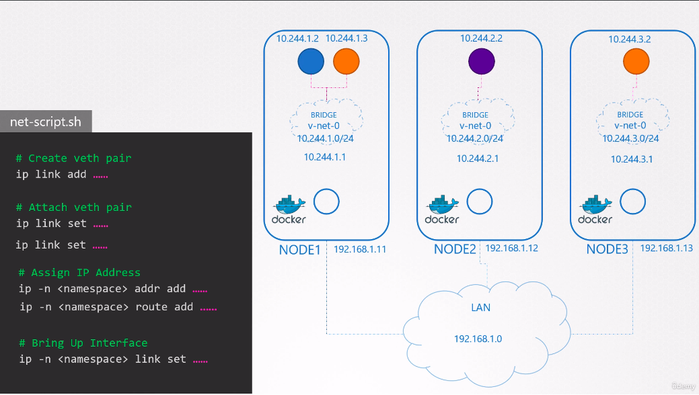
- When containers are created:
	- 1. Kubernetes creates `network namespaces` for them to enable communication between them 
	- 2. We create a `bridge network` on each node, And then bring them **up**
	- 3. Assign an `IP address` to the interfaces or networks. Choose any private address range: `10.244.1.0/24` ,`10.244.2.0/24`, `10.244.3.0/24` 
	- 4. Set the IP address for the `bridge interface` 

==> The pods all get their own **unique** IP address and are able to communicate with each other on their own nodes
### Part-2: Connect Pods from other Nodes 

As of now, the **blue** pod has no idea where the address `10.244.2.2` is because it is on a **different network**. So it routes to **Node01** as it is the default gateway node. **Node01** doesn't know either since 10.244.2.1 is a **private** network.
- Add a route to `node01` routing table to route traffic to `10.244.2.2`
- Similarly, we configure `route` on **all host** to all the **other hosts** with information regarding the respective networks within them </br>
==> This works fine in this simple setup, but this will require a lot more configuration whenthe underlying network architecture gets **complicated**
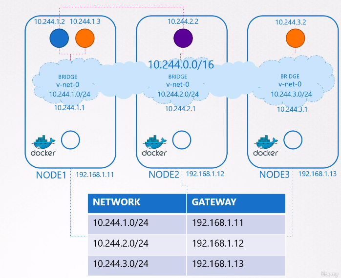
- Instead of having to configure `routes` on each server, a better solution is to do that on a `router`
- If we have one `router` in our network and **point all hosts** to use that as the `default gateway`
- The **individual** virtual networks we created with the address `10.244.1.0/24` on each node now form a **single large network** with the address 10.244.0.0/16`

==> We performed a number of **manual steps** to get the environment ready. We then wrote a `script` that can be run for each container that performs the necessary steps required to connect each container to the network. So how do we **run the script automatically** when a port is created on Kubernetes?
### Solution: CNI
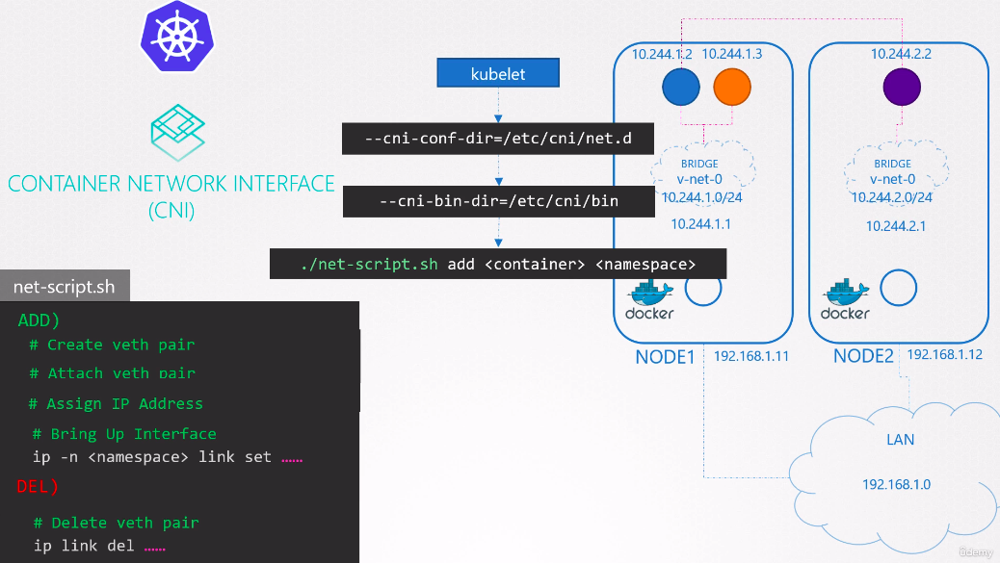 
- `CNI` tells Kubernetes that this is how you should call a script as soon as you create a container
-  `CNI` tells us This is how your script should look like.
- `The script` It should have an `ADD` section that will take care of **adding a container** to the network and a `delete` section that will take care of deleting container interfaces from the network and freeing the IP address
- `The Kubelet` looks at the` CNI configuration` passed as a `command line argument` and identifies our **scripts name**
- It then looks in the `CNI bin directory` to find our script and then executes the script with the `ADD` command and the **name** and **namespace ID** of the `container`
- Every pod gets its unique IP address
- Every pod should be able to communicate with any other pod in the same node with its IP address
- Every pod should be able to communicate with any other pod in other nodes without using NAT with its IP address
- There are many networking solutions we can implement, like flannel, cilium or weaveworks that take care of these requirements transparently. These are Container Network Interface-compliant plugins

## Container Networking Interface in Kubernetes 
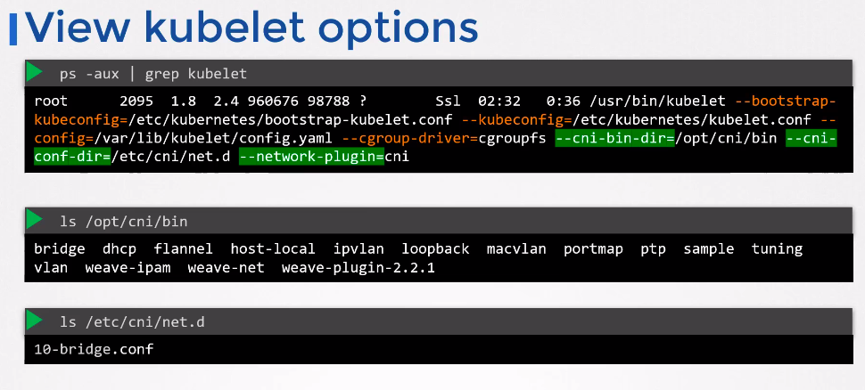 
- Networking in Kubernetes is managed by a CNI plugin
- The network plugins set to `CNI` 
- The `CNI bin` directory has all the supported `CNI plugins` as executables. Such as the bridge, dhcp, flannel etc
- The `CNI-conf` directory : this is where kubelet looks to find out which plugin needs to be used.
- This CNI plugin is configured in the Kubelet configuration file for each node

## Weave CNI solution 
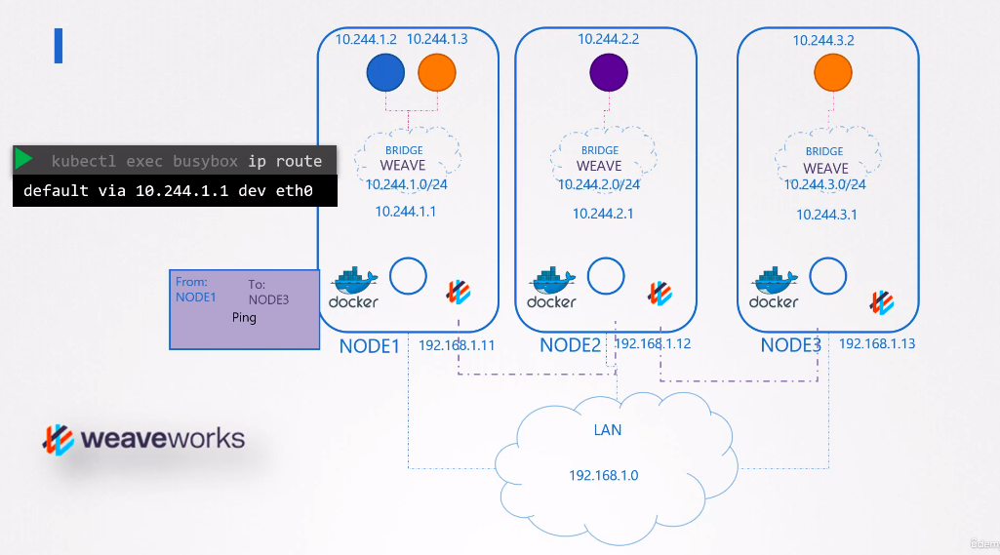 
- Example of a networking solution on Kubernetes
- Weave deploys an `agent` on **each node**
- They communicate with each other to exchange information **regarding the nodes and networks and PODs** within them.
- Each agent stores a **topology of the entire setup**, that way they know **the pods and their IPs on the other nodes**.
- They keep track of network status of the cluster
- Weave creates its **own interface bridges** and name it `weave`
- When a packet needs to go to another node, it goes through `Weave agent`, and it makes the decision to where it needs to go
- Packets are encapsulated and sent to the target node
- Once on the other side, the other `weave agent` retrieves the `packet`, **decapsulates** and **routes** it to the right POD.
- It is deployed as a daemonset, so a copy of weave is executed in each node as a pod

## IP address management in Kubernetes
- The CNI plugin is responsible for assigning IP addresses to pods
- CNI handles this with the `host-local` and `DHCP` plugin(get-free-ip-from-host)
- Weave handles this transparently for us

## Service networking 
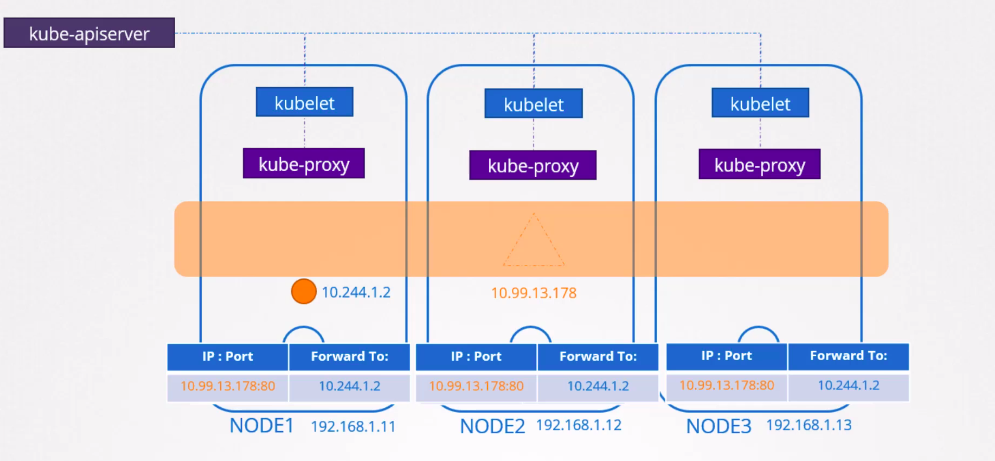 
- Until now we have talked about networking **between individual pods**
- We usually want to use a **service to access a set of pods**
- Service is just a `virtual object`, that is accessible **across the cluster** by any other resource using a **ClusterIP**
- We can also export the service externally with NodePort(like clusterIp but it exposes the application on a port on all nodes in the cluster that external users or applications have access to)
- Each node runs a `Kube-proxy` component
- Kube-proxy watches the changes in the cluster through the api-server and every time a **new service is created**, Kube-proxy gets into action
- Every time a pod is created the kublete invokes the CNI to make the necessary network changes and kube-proxy communicates the changes to the rest of the cluster nodes
- When we create a `service object`, It is assigned an `IP address` from a **predefined range**
- The `Kube-proxy` components running on each node gets that IP address and creates forwarding rules on each node in the cluster
- **Any traffic coming to this IP(the IP of the service) should go to the IP of the pod**
- the kube-proxy component **creates** and **deletes** these rules.
- NodePort is a combination of IP and port to forward to a correct pod
- kube-proxy works using `iptables` by default
- You can list iptables rules on a node and check its configuration, as all rules have a comment on what they do
- These rule changes are logged to the `kube-proxy` log file.

## DNS in Kubernetes
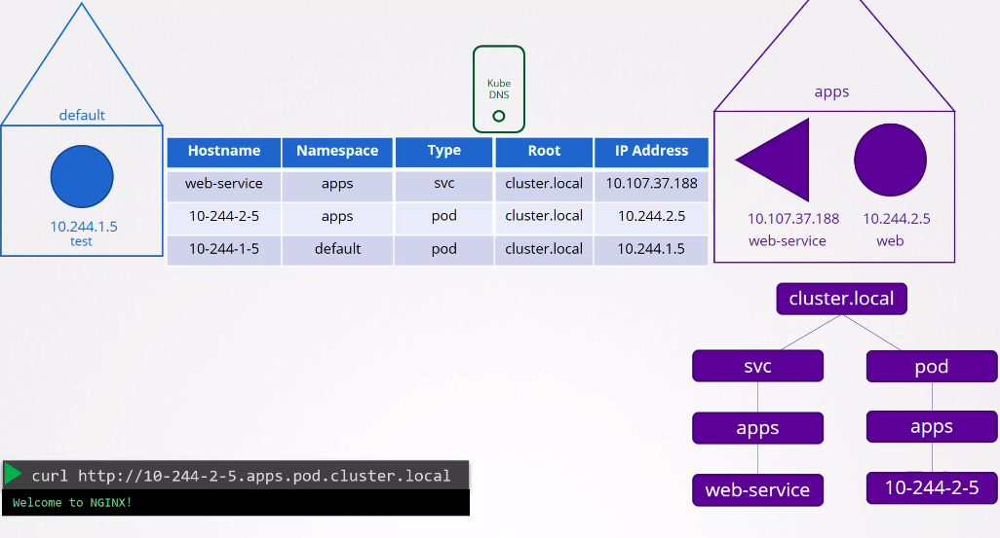 
- Each node in the cluster has a `DNS name` and `IP address`
- Pods and services **within** the cluster get a `DNS name` and `IP address`
- If we are on the same namespace, we can call a service by just using its name, like https://service-name. If the namespace is different, we add a top-level domain using the namespace name, https://service-name.namespace
- Services get grouped using an svc domain block, https://service-name.namespace.svc
- Fully-qualified domain names are grouped under a top-level domain, cluster.local by default, which we can refer to as https://service-name.namespace.svc.cluster.local
- We can do the same for pods, but using the IP with dashes as a name and changing **svc** for **pod**
- **DNS records for PODs are not created by default. But we can enable that explicitly**

## CoreDNS
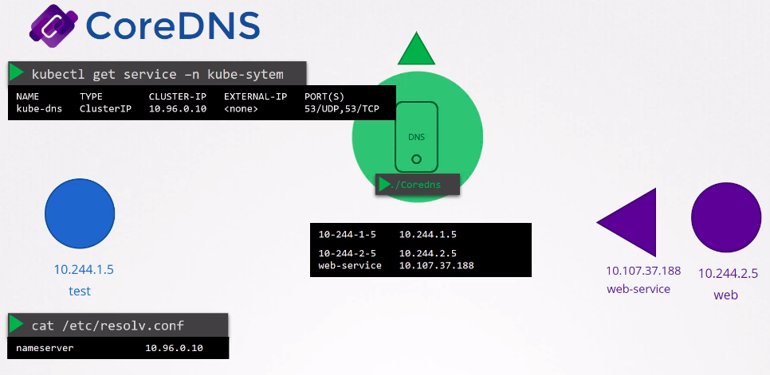 
- In-cluster DNS is managed by `CoreDNS`, a central DNS server in the cluster
- Pods are all pointed to the `CoreDNS` pod as a **DNS server**
- When a pod is created, an entry is added to CoreDNS for resolution using its IP()
- For `services` it uses the **service name**
- For `pods` it forms **hostnames** by replacing dots with dashes in the IP address of the pod
- CoreDNS is deployed as **2 pods** for fault toleration
- CoreDNS uses a **configuration file** named `Corefile`, under `/etc/coredns` by default
- The pod records are disabled by default, can be enabled by adding `pods insecure` to the kubernetes configuration block in the Corefile
- CoreDNS watches for changes in the cluster and adds or deletes DNS entries accordingly
- **CoreDNS pods** are exposed through the `kube-dns service`, **the IP addr of this service is configured as the nameserver on pods**
- The information about the `DNS server` `cluster-IP` and `top-level domain` is stored in the `Kubelet configuration` in the worker nodes
- services can answer DNS queries by just using their service name. Pods require the fully qualified domain name
 
## Ingress
- Service NodePorts require us to use a port over 35000 that has to be in the URL unless you use a **proxy(forward requests on port 80 to port 38080 on your nodes)**
- If we are on a cloud provider we can use a `Network LoadBalancer` type Service, which allows the requests to enter through a **Cloud Loadbalancer** that handles routing
- If we add more services, we need more load balancers, which can get expensive, and configuring SSL gets complicated
- Ingress helps users access application using a **single Externally accessible URL**, that you can configure to route to **different services** within your cluster based on the URL path, At the same time implement **SSL security** as well.
- Ingresses are **scalable layer 7 load balancers** that are **native to Kubernetes**

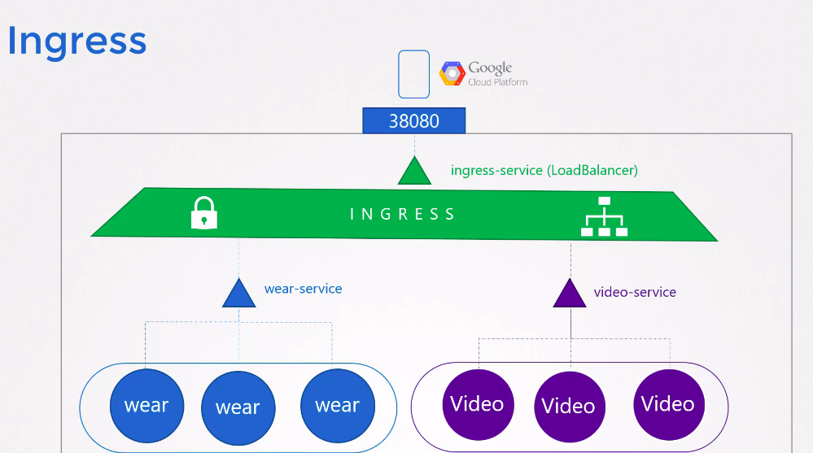 
- Ingress needs to be **exposed** through a `Cloud Load balancer` or through a `nodePort`, but after that all configuration lives in Kubernetes
- We deploy an `Ingress Controller` (nginx, haproxy, traefik), and `Ingress Resources`(routing rules)
- Ingress Resources are created using **definition files** like pods deployments and services

### Ingress Controller
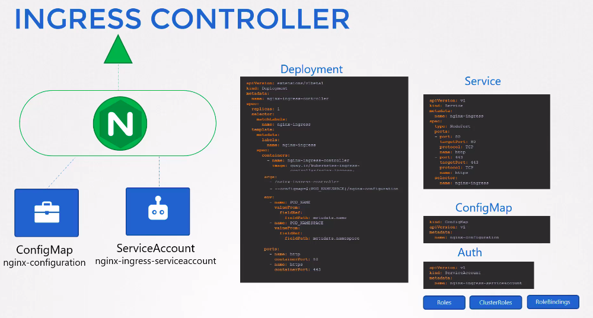 
- **Ingress controllers are not just a 7 layer load balancer, they have intelligence built-in to monitor the cluster in order to detect new rules and resources automatically**
- We do not have an `Ingress Controller` on Kubernetes **by default**. So we must deploy one like : `GCE(Google layer 7 LB)`, `Nginx`..
- To deploy an `Ingress Controller` we need a : 
 	- `Deployment` of the `nginx-ingress` image,
 	- `Service` to expose it
 	- `ConfigMap` to feed nginx configuration data
 	- `Service account` with the right permissions to access all of these objects.
- We need to provice the namespace, name and ports that the ingress controller will use

### Ingress Rules
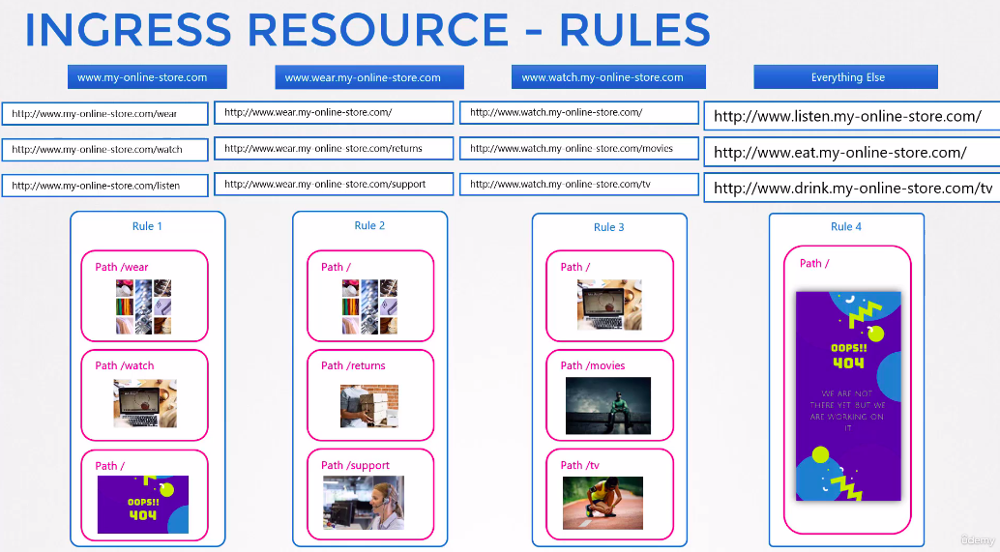 
- After the ingress controller is created we will add ingress rules, which will route traffic depending on rules like domain name
-  We have rules at the top for **each host** or **domain name** and **within** each rule you have different paths to route traffic based on **the URL**.
- Kind is Ingress, and on spec we will specify what pod or pods we will target depending on our rules
- We can see these rules with `kubectl get ingress`
- Rules are applied consecutively until one matches 

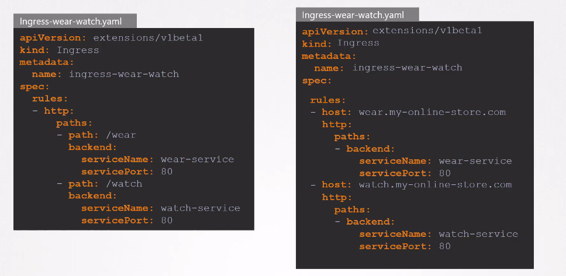 
- We create a host for each **domain** and a we route the within the traffic domain based on **paths** 

# Designing a Kubernetes cluster

## Cluster requirements
- Depending on your current state, you may want to build a cluster in one way or another
- Define the purpose that this cluster will have, like education or production
- Check the cloud adoption level in your company, maybe you want the cluster on-premise
- Workloads that will run on the cluster, hardware requirements, network traffic levels
- `Production workloads` would require a **multi-master** setup if **on-premise**
- `Development clusters` can be **single-node**, as they are volatile and non-critical
- **Large clusters may want to separate the etcd servers to their own instances**

## Choosing Kubernetes infrastructure
- Kubernetes can be deployed in a lot of environments, from a laptop to a cloud environment
- Kubeadm can automate a lot of work of on-prem cluster setup in Linux. It is not an available option on Windows
- We can also use tools like Minikube, k3s or rancher, which automatically set up working Kubernetes clusters

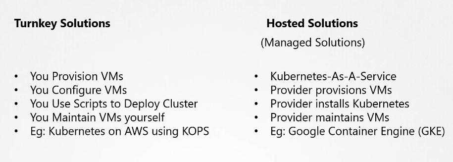 
- `Turnkey solutions` like OpenShift, where you provision the required **VMs** and use some kind of tools or scripts to configure kubernetes cluster on them.
- `Hosted solution` where your cluster is set up by your provider like AWS or GCE
- `OpenShift` is an **open source** container application platform and is built on top of kubernetes. It provides a set of additional tools and a nice **GUI** to create and manage kubernetes constructs and easily integrate with CI/CD pipelines etc.

## High availability Kubernetes
- If a master node is lost, as long as the workers are up, they will keep service until they start failing
- When failed, as the **master** is unavailable, applications do not self-heal
- To avoid this we should consider a `multi-master` Kubernetes setup in a **Production environment**
- Available in an **active-active**(the two master nodes run at the same time) configuration
- Clustering or load balancing depends on what element we are tackling
- We will configure a `Load balancer` that splits traffic between the kube-apiserver instances so we do not duplicate kubectl commands
- `kube-scheduler` and `kube-controllermanager` might **duplicate resources if ran in parallel**, so they run in an **active-passive** mode where only one runs at the same time, controlled by the `leader-elect` variable when starting kube-apiserver
- `etcd` can be configured either on the master nodes **(stacked)**, or on their own nodes **(external)**, which means a failed master node will not result in a lost etcd server state
- kube-apiserver has a configuration pointer to the etcd servers, and it will read and write from any of the available etcd instances

## High availability ETCD
- etcd allows us to have a **distributed data format**, allowing us to **read and write** data from **any** of the instances
- etcd keeps data **consistent** in its database by **delegating writes to a master**
- If a write enters through a slave node, the write is forwarded to the master, then it is distributed to the slaves
- When the cluster is set up, a master is elected **randomly**, which handles writes
- After this, a **keepalive** is continually sent. If it is not recieved for some time, the rest of the nodes will elect a new master
- A write is considered **complete** if it is written to **the majority of the nodes of the cluster**, considered a `quorum, (numberOfNodes / 2) + 1`
- If you have 2 instances of etcd, the quorum is still 2 and it cannot be met, so we need at least 3 instances of etcd in the cluster
- So having 2 instances is like having one instance it doesn't offer you any real value as quorum cannot be met. Which is why it is recommended to have a minimum of **3 instances** in an ETCD cluster. That way it offers a fault tolerance of at least **1 node**.
- If you lose one, you can still have quorum and the cluster will continue to function.
- Our fault tolerance is calculated by subtracting the quorum from the total nodes in the cluster
- We should always choose an **odd number of nodes**, as an even number of instances can lead to a **lock situation**

# Troubleshooting

## Application failure
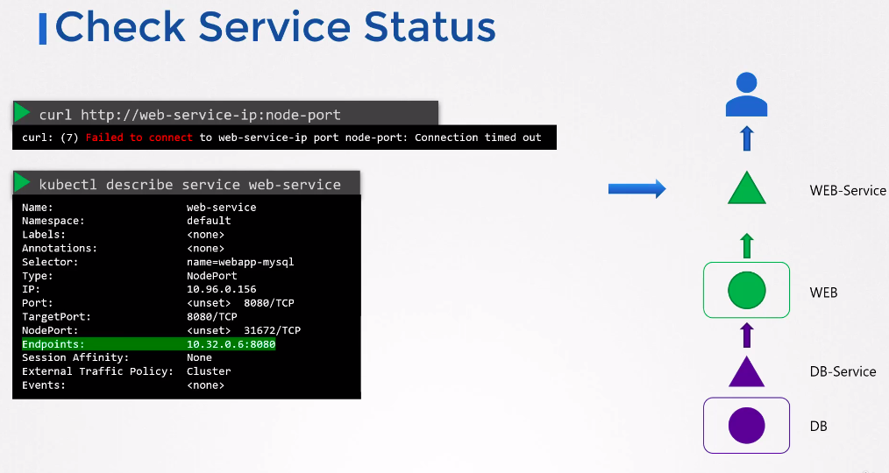 
Let's troubleshoot a **two tier application** that has a web and a database server:
- Think about a chart depicting how your application interacts and **check every link on the chain**
- Check **accessibility** to a pod
- Check **pod events**
- Check **pod restarts**
- CHeck **pod logs** (current and previous)
- Check target port configurations
- Check **target service** name configurations
- Check target service selectors
- Check deployment and pod environment variables
- Check exposed port configuration

## Control plane failure
- Check the nodes status with kubectl get nodes
- Check the pod status of the cluster elements like the kube-apiserver
- CHeck the configuration of the master elements
- If installed without kubeadm, check the system services like the kubelet
- Check the kube-apiserver and the kube-scheduler on the master nodes
- Check the kubelet and the kube-proxy in the worker nodes
- Check logs of these components

## Worker node failure
- Check the reported status of the worker node from the master, if Ready or NotReady
- Describe the failed node to check status conditions
- If crashed or impossible to contact it will report as Unknown
- Check the kubelet status on the worker nodes
- Check the kubelet logs with journalctl
- Check the kubelet certificates configuration references
- Check the kubelet configuration like port target and name resolution

## Network troubleshooting
- Check the kubelet configuration for CNI plugin directory 
- Check the kubelet configuration for network plugin selection 
- Check CoreDNS status
- Check CoreDNS logs
- Check CoreDNS configuration
- Check the kube-proxy daemonset or binary
- Check the kube-proxy configuration file reference and contents
- check the CNI provider configured on the cluster

# JSON Path

- It's a `Query` language that help you **query data** represented in `JSON` ou `YAML` format
- Just like `SQL` is a query language for `MySql databases`

## JSON Path Dictionary
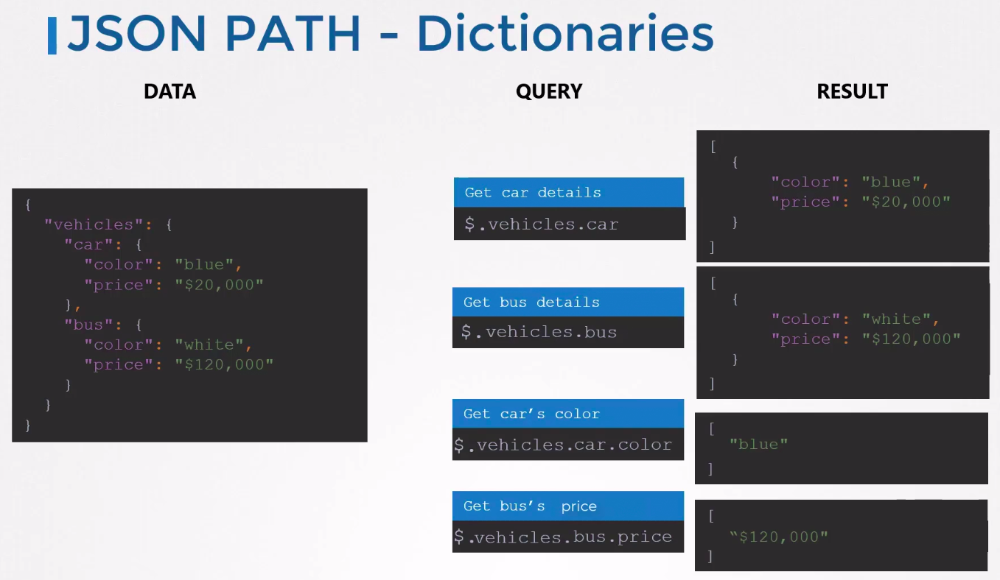 
- Anything inside the pair of curly braces is a dictionary
- The **top level dictonary** of a JSON file that has no name is known as the `root element` of a JSON documenet
- the `root element`is denoted by `$`
- All results of a JSON path query is encapuslated within an **array**

## JSON Path Lists
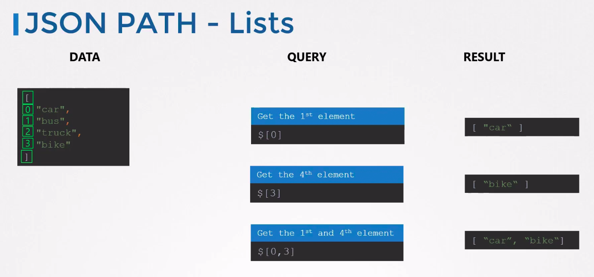 
- **No curly braces only square brackets**, the `root element`is an **array** denoted by a `$`

## JSON Path Dictionary & Lists
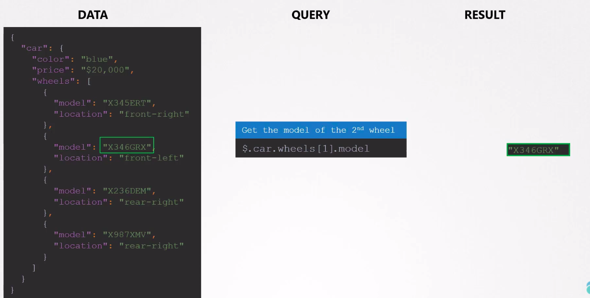 

## JSON Path Criteria
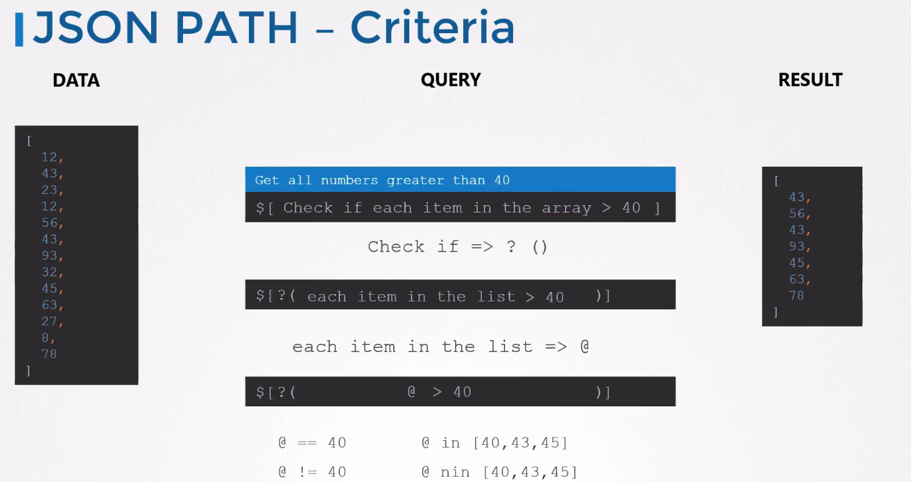 

## JSON Path Wildcard
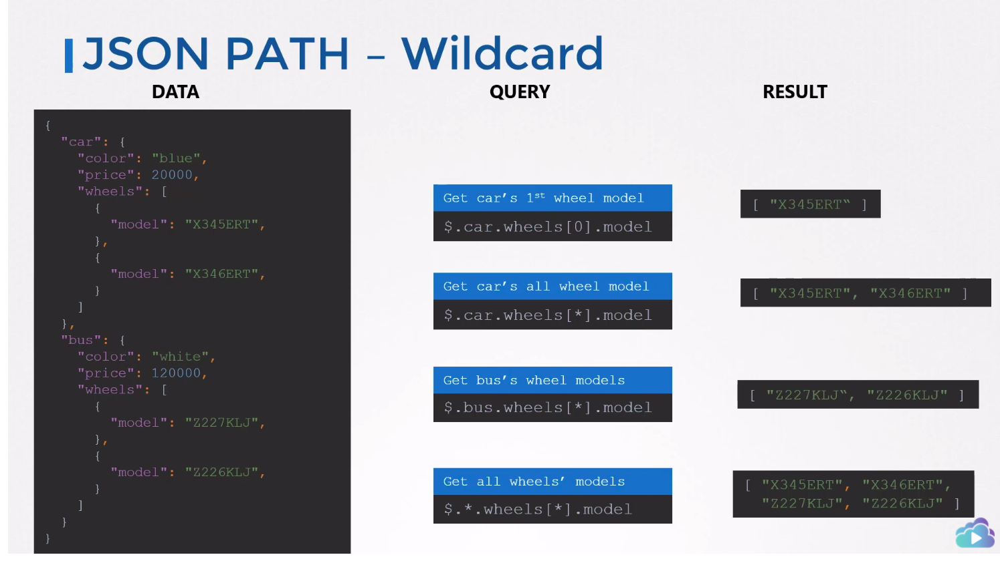 
- A star wildcard within a dictionary means all or any property within a dictionary

## JSON Path List Indexing
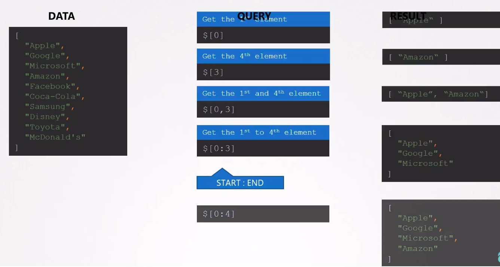 
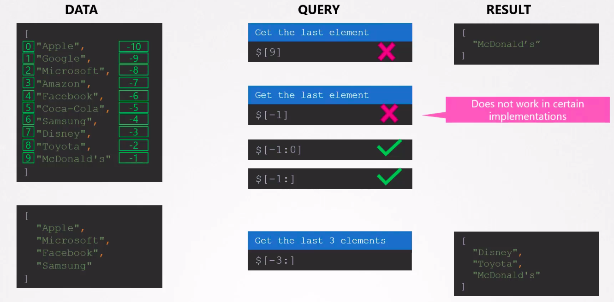
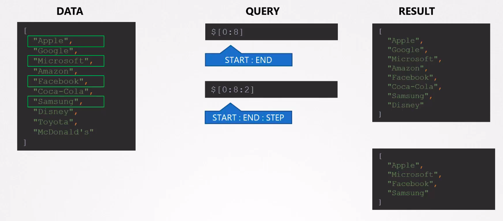

# JSON PATH Use case – Kubernetes
## Why JSON Path 
- In a prduction cluster we have thousnd of resources within a cluster 
- Viewing details by going through 1000 of this resources with just kubectl will be overwhelming
- thats why kubectl support a JSON path option that makes filtering data across data sets using complex criteria
- With JSON Path queries we can filter and format the output of a kubectl command as we like 

## JSON Path with Kubectl
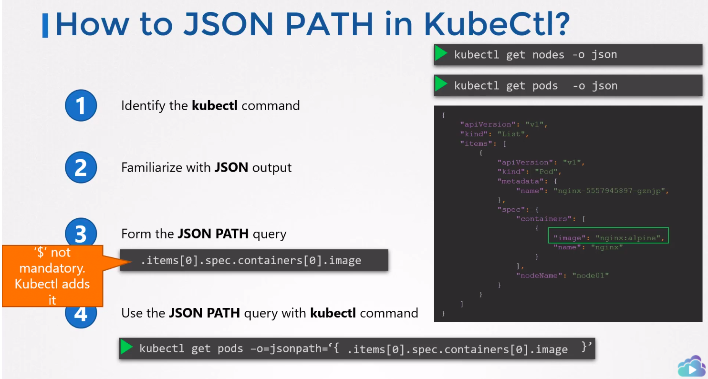 </br>
### Examples
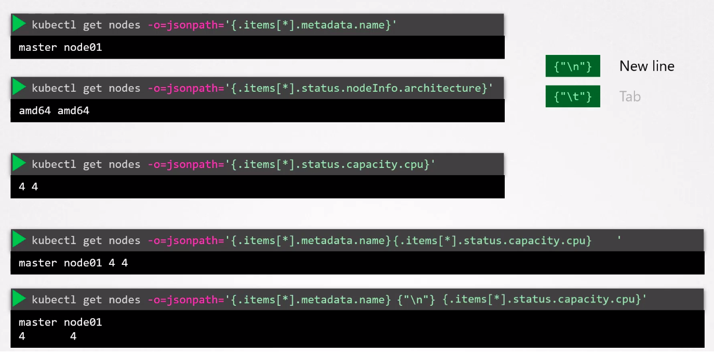</br>
### Loops -Range
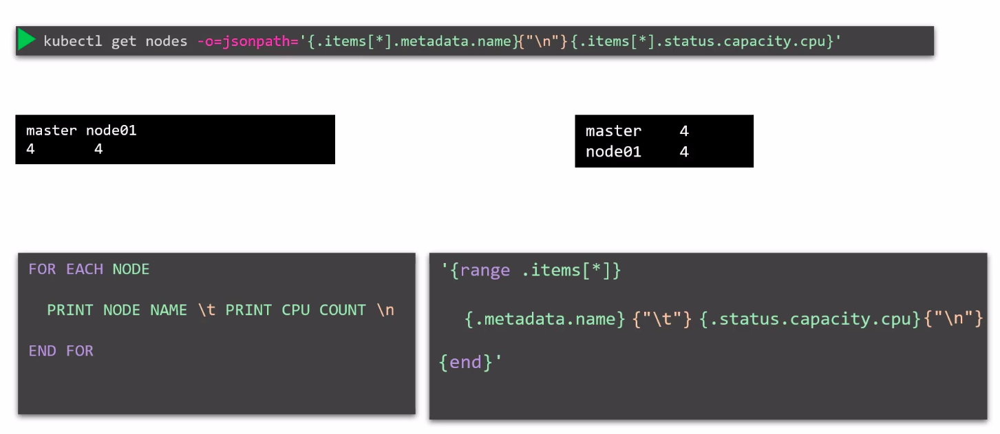

# Useful bookmarks

- [Create an object (pods, deployments...)](https://kubernetes.io/docs/tasks/manage-kubernetes-objects/imperative-command/#how-to-create-objects)
- [Create a replicaSet definition](https://kubernetes.io/docs/concepts/workloads/controllers/replicaset/#example)
- [Create a deployment](https://kubernetes.io/docs/concepts/workloads/controllers/deployment/#creating-a-deployment)
- [Create a resourceQuota for a namespace](https://kubernetes.io/docs/concepts/policy/resource-quotas/#viewing-and-setting-quotas)
- [Create a service](https://kubernetes.io/docs/concepts/services-networking/service/#publishing-services-service-types)
- [Assign a pod to a node](https://kubernetes.io/docs/concepts/scheduling-eviction/assign-pod-node/#nodename)
- [Taint a node](https://kubernetes.io/docs/concepts/scheduling-eviction/taint-and-toleration/#concepts)
- [Add a toleration to a pod declaration](https://kubernetes.io/docs/concepts/scheduling-eviction/taint-and-toleration/#concepts)
- [Add NodeAffinity to a pod](https://kubernetes.io/docs/tasks/configure-pod-container/assign-pods-nodes-using-node-affinity/)
- [Add requests and limits to a container](https://kubernetes.io/docs/concepts/configuration/manage-resources-containers/#meaning-of-memory)
- [Create a DaemonSet](https://kubernetes.io/docs/concepts/workloads/controllers/daemonset/#create-a-daemonset)
- [Check the kubelet process config](https://kubernetes.io/docs/tasks/administer-cluster/kubelet-config-file/#start-a-kubelet-process-configured-via-the-config-file)
- [Pod definition snippet for a new kube-scheduler [!]Other steps required detailed on this documentation[!]](https://kubernetes.io/docs/tasks/extend-kubernetes/configure-multiple-schedulers/#define-a-kubernetes-deployment-for-the-scheduler)
- [Specify the scheduler for a pod](https://kubernetes.io/docs/tasks/extend-kubernetes/configure-multiple-schedulers/#specify-schedulers-for-pods)
- [Add a command to a pod definition](https://kubernetes.io/docs/tasks/inject-data-application/define-command-argument-container/#define-a-command-and-arguments-when-you-create-a-pod)
- [Create a local PersistentVolume](https://kubernetes.io/docs/tasks/configure-pod-container/configure-persistent-volume-storage/#create-a-persistentvolume)
- [Create a configMap](https://kubernetes.io/docs/concepts/configuration/configmap/#configmaps-and-pods)
- [Add a single configMap value to a pod](https://kubernetes.io/docs/concepts/configuration/configmap/#configmaps-and-pods)
- [Add an entire ConfigMap to a pod](https://kubernetes.io/docs/tasks/configure-pod-container/configure-pod-configmap/#configure-all-key-value-pairs-in-a-configmap-as-container-environment-variables)
- [Create a secret](https://kubernetes.io/docs/tasks/configmap-secret/managing-secret-using-config-file/#create-the-config-file)
- [Add the secret to a pod](https://kubernetes.io/docs/concepts/configuration/secret/#use-case-as-container-environment-variables)
- [Configure an InitContainer](https://kubernetes.io/docs/concepts/workloads/pods/init-containers/#init-containers-in-use)
- [Stop new pods from being scheduled in a node](https://kubernetes.io/docs/concepts/architecture/nodes/#manual-node-administration) 
- [Remove the workloads from a node](https://kubernetes.io/docs/tasks/administer-cluster/safely-drain-node/#use-kubectl-drain-to-remove-a-node-from-service)
- [Upgrade a Kubernetes cluster](https://kubernetes.io/docs/tasks/administer-cluster/kubeadm/kubeadm-upgrade/)
- [Backup etcd cluster](https://kubernetes.io/docs/tasks/administer-cluster/configure-upgrade-etcd/#snapshot-using-etcdctl-options)
- [Restore etcd cluster [!]requires other steps detailed in the commands in the next section[!]](https://kubernetes.io/docs/tasks/administer-cluster/configure-upgrade-etcd/#restoring-an-etcd-cluster)
- [Default certificate locations](https://kubernetes.io/docs/setup/best-practices/certificates/)
- [Generate a certificate for the cluster](https://kubernetes.io/docs/tasks/administer-cluster/certificates/#openssl)
- [Create a certificate request for a user](https://kubernetes.io/docs/reference/access-authn-authz/certificate-signing-requests/#normal-user)
- [Accept or deny certificate requests](https://kubernetes.io/docs/reference/access-authn-authz/certificate-signing-requests/#approval-rejection)
- [Define and extend a kubeconfig file](https://kubernetes.io/docs/tasks/access-application-cluster/configure-access-multiple-clusters/#define-clusters-users-and-contexts)
- [Create a role](https://kubernetes.io/docs/reference/access-authn-authz/rbac/#role-example)
- [Create a roleBinding](https://kubernetes.io/docs/reference/access-authn-authz/rbac/#rolebinding-example)
- [Create a ClusterRole](https://kubernetes.io/docs/reference/access-authn-authz/rbac/#clusterrole-example)
- [Create a ClusterRoleBinding](https://kubernetes.io/docs/reference/access-authn-authz/rbac/#clusterrolebinding-example)
- [Create a ServiceAccount](https://kubernetes.io/docs/tasks/configure-pod-container/configure-service-account/#use-the-default-service-account-to-access-the-api-server)
- [Add the ServiceAccount to a pod definition spec](https://kubernetes.io/docs/tasks/configure-pod-container/configure-service-account/#use-the-default-service-account-to-access-the-api-server)
- [Create a docker registry login secret](https://kubernetes.io/docs/tasks/configure-pod-container/pull-image-private-registry/#create-a-secret-by-providing-credentials-on-the-command-line)
- [Add the pull secret to a pod spec](https://kubernetes.io/docs/tasks/configure-pod-container/pull-image-private-registry/#create-a-pod-that-uses-your-secret)
- [Add security context variables to a pod (supported at pod and container level)](https://kubernetes.io/docs/tasks/configure-pod-container/security-context/#set-the-security-context-for-a-pod)
- [Add kernel capabilities to a container (not supported at pod level)](https://kubernetes.io/docs/tasks/configure-pod-container/security-context/#set-capabilities-for-a-container)
- [Create a networkPolicy](https://kubernetes.io/docs/concepts/services-networking/network-policies/#networkpolicy-resource)
- [Configure volume as HostPath for a pod](https://kubernetes.io/docs/concepts/storage/volumes/#hostpath-configuration-example)
- [Create a persistent volume](https://kubernetes.io/docs/tasks/configure-pod-container/configure-persistent-volume-storage/#create-a-persistentvolume)
- [Create a persistent volume claim](https://kubernetes.io/docs/tasks/configure-pod-container/configure-persistent-volume-storage/#create-a-persistentvolumeclaim)
- [Attach a persistent volume claim to a pod](https://kubernetes.io/docs/concepts/storage/persistent-volumes/#claims-as-volumes)
- [Create a storage class](https://kubernetes.io/docs/concepts/storage/storage-classes/#the-storageclass-resource)
- [Apply a network addon to the cluster, here WeaveNet (step 2)](https://kubernetes.io/docs/setup/production-environment/tools/kubeadm/high-availability/#steps-for-the-first-control-plane-node)
- [CNI plugin file locations](https://kubernetes.io/docs/concepts/extend-kubernetes/compute-storage-net/network-plugins/#usage-summary)
- [Check DNS resolution from inside a pod](https://kubernetes.io/docs/tasks/administer-cluster/dns-debugging-resolution/#before-you-begin)
- [Create an ingress](https://kubernetes.io/docs/tasks/access-application-cluster/ingress-minikube/?ref=hackernoon.com#create-an-ingress)
- [Installing kubeadm](https://kubernetes.io/docs/setup/production-environment/tools/kubeadm/install-kubeadm/)
- [Setup cluster from scratch with kubeadm](https://kubernetes.io/docs/setup/production-environment/tools/kubeadm/create-cluster-kubeadm/#initializing-your-control-plane-node)
- [JSONPath documentation](https://kubernetes.io/docs/reference/kubectl/jsonpath/)

# Commands to remember
## Create a base pod yaml
`k run [name] --dry-run=client --image=[image] -o yaml > pod.yaml`

## Create a deployment yaml
`kubectl create deployment --image=[image] [name] --dry-run=client -o yaml > deployment.yaml`

## Exposing a pod port on creation
`kubectl run [pod name] --image=[image] --port=[port to expose]`

## Exposing a pod port after creation with clusterIP. Same as creating a service.
`kubectl expose [pod name] --port=[pod port to expose]`

## Label a resource
`kubectl label [resource type] [resource] [label]=[value]`

## Save an ETCD backup
`ETCDCTL_API=3 etcdctl --endpoints=https://127.0.0.1:2379 --cacert=/etc/kubernetes/pki/etcd/ca.crt --cert=/etc/kubernetes/pki/etcd/server.crt --key=/etc/kubernetes/pki/etcd/server.key snapshot save /opt/snapshot-pre-boot.db`

## Restore an ETCD backup
`ETCDCTL_API=3 etcdctl  --data-dir /var/lib/etcd-from-backup snapshot restore /opt/snapshot-pre-boot.db`, also recreate the static etcd pod to point to the new restored directory

## Install WeaveWorks with specific network range
`kubectl apply -f "https://cloud.weave.works/k8s/net?k8s-version=$(kubectl version | base64 | tr -d '\n')&env.IPALLOC_RANGE=[network]/[netmask]"`

## DNS query from a pod
`kubectl exec -n [source pod namespace] -ti [source pod name] -- nslookup [target pod DNS name]`

## Get a json object of cluster nodes
`kubectl get nodes -o json`

## Get a json object of a single cluster node
`kubectl get node node01 -o json`

## Get the names of all the nodes in a space-separated list
`kubectl get nodes -o=jsonpath='{.items[*].metadata.name}'`

## Get the node OS image from all nodes
`kubectl get nodes -o=jsonpath='{.items[*].status.nodeInfo.osImage}'`

## Get users from a Kubeconfig in json 
`kubectl config view --kubeconfig=[kubeconfig_file_location] -o jsonpath="{.users[*].name}"`

## Get persistent volumes, sorted by capacity
`kubectl get pv --sort-by=.spec.capacity.storage`

## Get specific columns from command output
`kubectl get pv -o=custom-columns=NAME:.metadata.name,CAPACITY:.spec.capacity.storage`

## Get the context name for aws-user
`kubectl config view --kubeconfig=[kubeconfig_file_location] -o jsonpath="{.contexts[?(@.context.user=='aws-user')].name}"`
